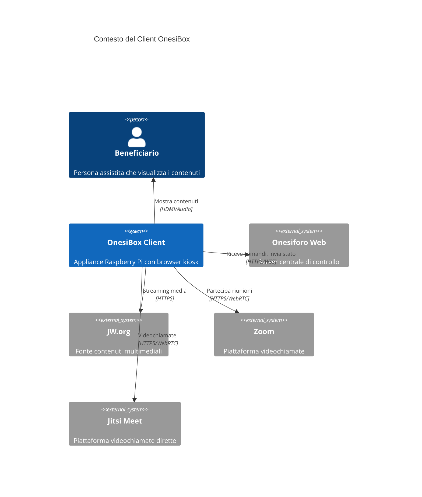
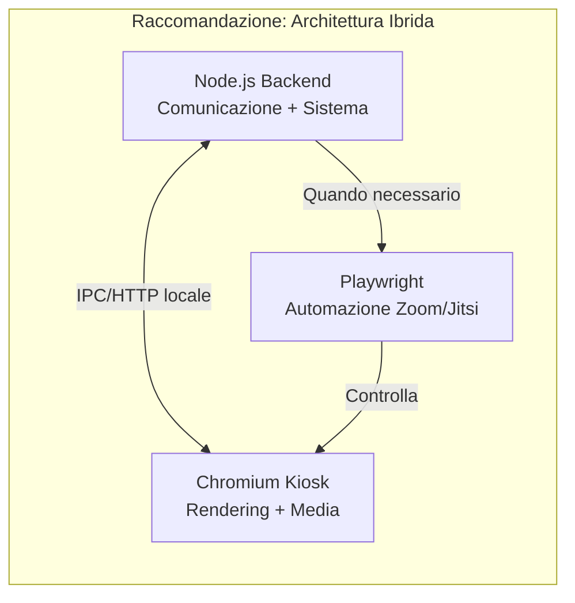
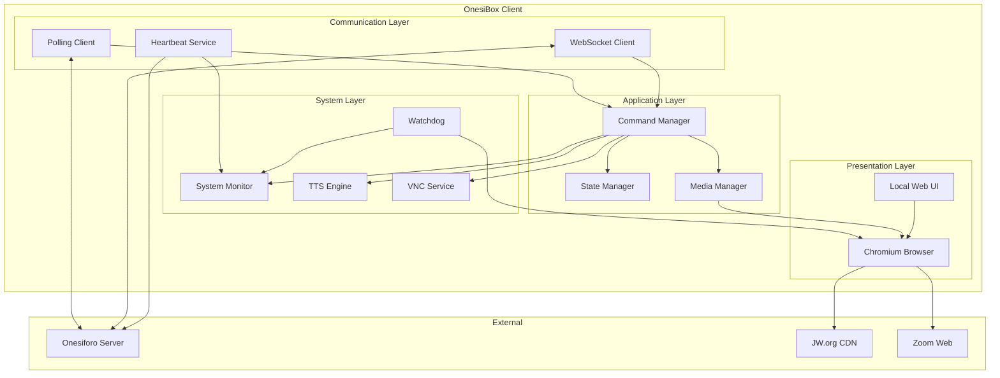
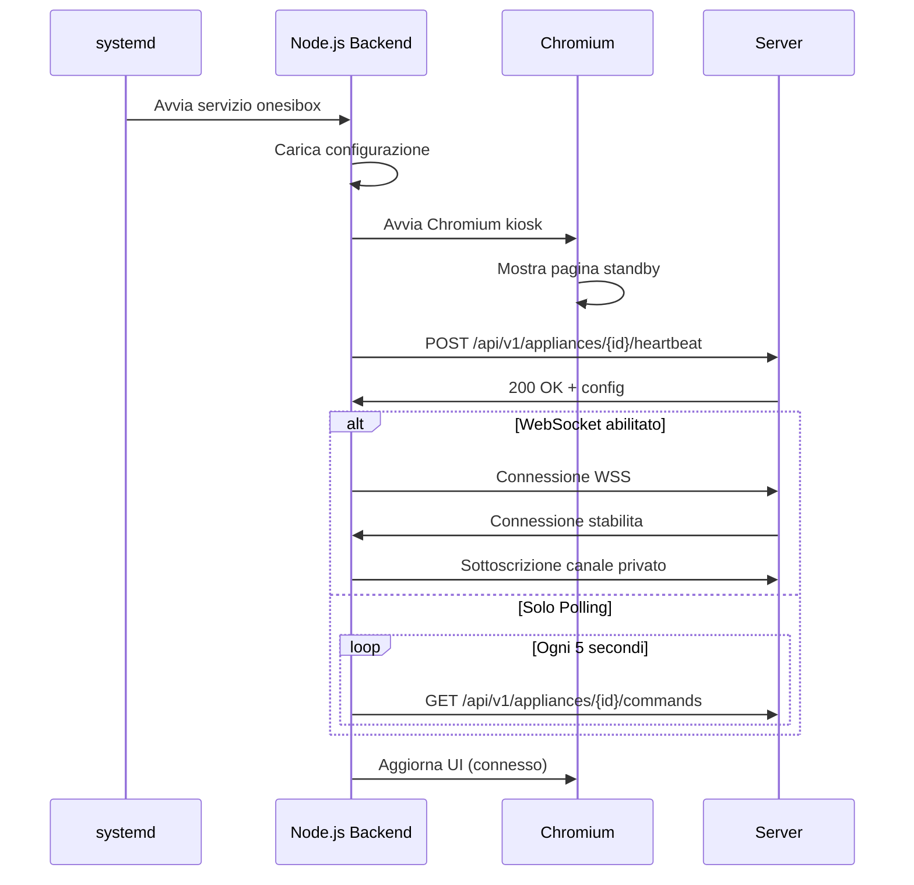
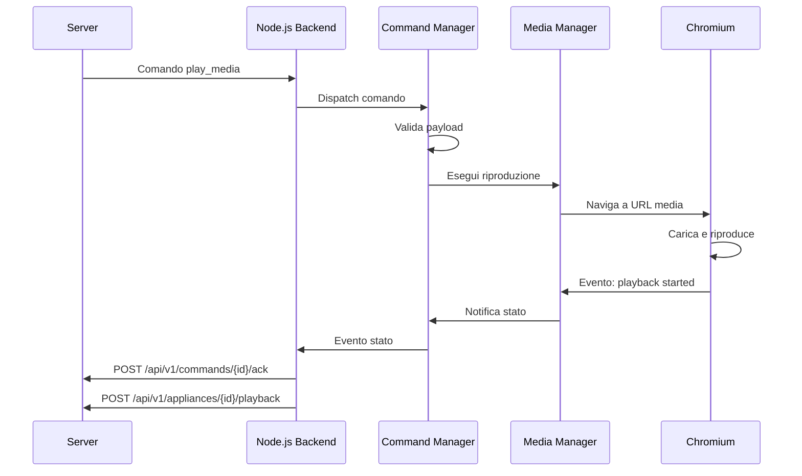
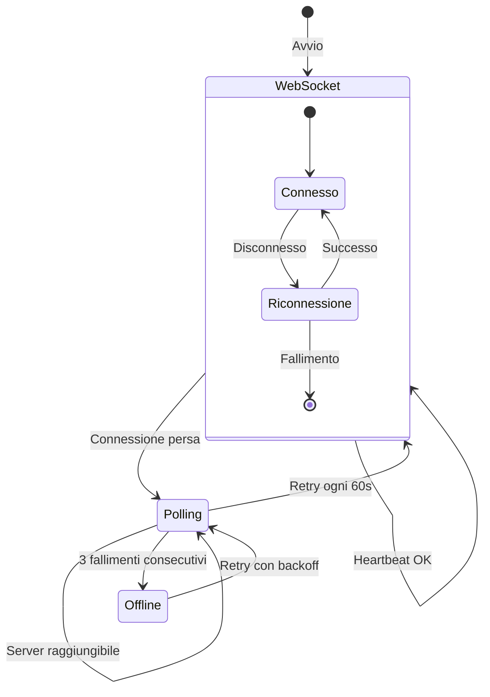
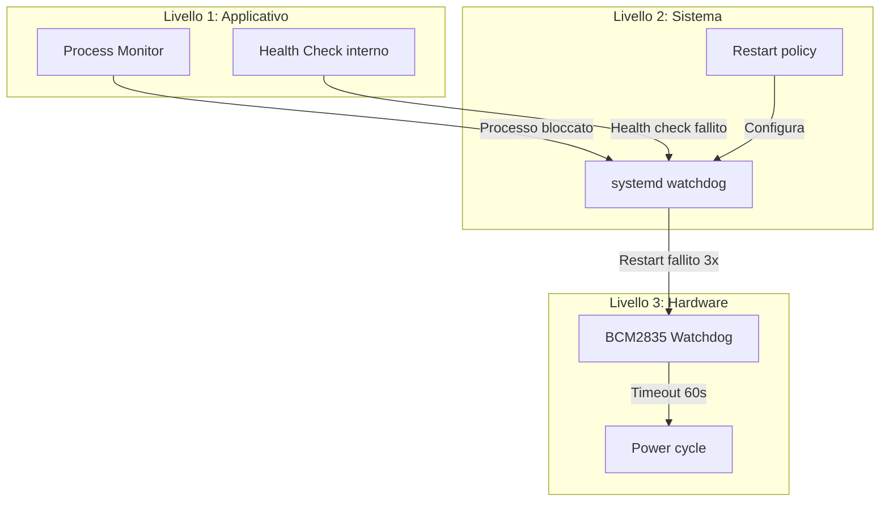

# Architettura del Client OnesiBox

**Versione:** 1.0
**Data:** Gennaio 2026
**Stato:** Draft

---

## 1. Introduzione

### 1.1 Scopo del Documento

Questo documento descrive l'architettura tecnica del client OnesiBox, l'applicazione che gira sulle appliance Raspberry Pi installate presso le persone assistite. Il documento copre:

- Le scelte tecnologiche e le relative motivazioni
- L'architettura dei componenti interni
- I pattern di comunicazione con il server
- Le strategie di resilienza e auto-riparazione
- Le considerazioni di sicurezza

### 1.2 Glossario

| Termine | Definizione |
|---------|-------------|
| **OnesiBox** | Appliance hardware basata su Raspberry Pi |
| **Kiosk Mode** | Modalita di esecuzione del browser a schermo intero senza interfaccia utente |
| **Heartbeat** | Segnale periodico inviato al server per confermare la connettivita |
| **Watchdog** | Componente che monitora lo stato del sistema e interviene in caso di blocco |
| **Polling** | Tecnica di comunicazione basata su richieste periodiche al server |
| **WebSocket** | Protocollo per comunicazione bidirezionale persistente |

---

## 2. Panoramica dell'Architettura

### 2.1 Contesto di Sistema

Il client OnesiBox si colloca come componente periferico nel sistema Onesiforo, fungendo da interfaccia tra il server centrale e il beneficiario.



### 2.2 Principi Architetturali

L'architettura del client e stata progettata seguendo questi principi:

| Principio | Descrizione |
|-----------|-------------|
| **Zero interazione** | L'utente finale non deve mai interagire con il dispositivo |
| **Resilienza** | Il sistema deve auto-ripararsi in caso di errori |
| **Semplicita** | Architettura minimalista per ridurre i punti di fallimento |
| **Sicurezza** | Comunicazioni cifrate, accesso limitato, validazione input |
| **Efficienza** | Consumo minimo di risorse su hardware limitato |

---

## 3. Scelte Tecnologiche

### 3.1 Valutazione delle Alternative

Per implementare il client OnesiBox sono state valutate diverse tecnologie. Di seguito l'analisi comparativa.

#### 3.1.1 Opzione A: Electron + Node.js

**Descrizione:** Applicazione desktop basata su Electron che incorpora Chromium e Node.js.

| Pro | Contro |
|-----|--------|
| Controllo completo sul browser | Consumo RAM elevato (~300-500MB) |
| API Node.js per accesso sistema | Complessita di packaging |
| Singolo pacchetto distribuibile | Aggiornamenti piu complessi |
| Comunicazione IPC efficiente | Overhead rispetto a browser nativo |
| Ampia community e documentazione | |

**Consumo risorse stimato:** 400-600MB RAM

---

#### 3.1.2 Opzione B: Chromium Kiosk + Node.js Backend

**Descrizione:** Chromium in modalita kiosk controllato da un processo Node.js separato che gestisce la comunicazione con il server.

| Pro | Contro |
|-----|--------|
| Separazione delle responsabilita | Due processi da gestire |
| Browser nativo ottimizzato per Pi | Comunicazione inter-processo |
| Aggiornamenti indipendenti | Configurazione piu articolata |
| Minor consumo RAM complessivo | |
| Utilizzo di Chromium nativo ottimizzato | |

**Consumo risorse stimato:** 250-400MB RAM

---

#### 3.1.3 Opzione C: Chromium Kiosk + Pagina Web Locale

**Descrizione:** Chromium carica una pagina web locale (SPA) che gestisce autonomamente polling e WebSocket via JavaScript.

| Pro | Contro |
|-----|--------|
| Architettura minimalista | Accesso limitato al sistema (no TTS offline, no reboot) |
| Nessun processo aggiuntivo | Dipendenza da Web APIs |
| Facile da aggiornare (basta HTML/JS) | Meno controllo su errori browser |
| Consumo risorse minimo | Necessita estensione per funzioni avanzate |
| Compatibile con Playwright per automazione | |

**Consumo risorse stimato:** 200-300MB RAM

---

#### 3.1.4 Opzione D: Chromium controllato da Playwright

**Descrizione:** Un processo Node.js utilizza Playwright per controllare un'istanza di Chromium, automatizzando le interazioni.

| Pro | Contro |
|-----|--------|
| Controllo totale sul browser | Overhead di Playwright |
| Automazione robusta e testata | Dipendenza aggiuntiva |
| Gestione di Zoom/Jitsi via automazione | Consumo risorse maggiore |
| Debug e testing facilitati | Complessita implementativa |
| Gestione popup e permessi automatica | |

**Consumo risorse stimato:** 350-500MB RAM

---

### 3.2 Raccomandazione Tecnologica

**Soluzione raccomandata: Opzione B (Chromium Kiosk + Node.js Backend)** con possibilita di utilizzare Playwright per scenari specifici (es. automazione Zoom).



**Motivazioni:**

1. **Bilanciamento ottimale** tra controllo e consumo risorse
2. **Flessibilita**: Playwright puo essere attivato solo quando serve
3. **Manutenibilita**: Componenti separati aggiornabili indipendentemente
4. **Affidabilita**: Chromium nativo piu stabile su Raspberry Pi
5. **Compatibilita**: Soluzione testata su architettura ARM64

---

## 4. Architettura dei Componenti

### 4.1 Diagramma dei Componenti



### 4.2 Descrizione dei Componenti

#### 4.2.1 Communication Layer

**Polling Client**
- Interroga periodicamente il server per comandi pendenti
- Intervallo configurabile (default: 5 secondi)
- Gestisce retry con backoff esponenziale
- Attivo in Fase 1 e come fallback

**WebSocket Client**
- Connessione persistente al server Laravel Reverb
- Ricezione comandi in tempo reale
- Invio eventi di stato
- Riconnessione automatica con backoff

**Heartbeat Service**
- Invia segnali periodici al server (ogni 30 secondi)
- Include metriche di sistema (CPU, RAM, disco, temperatura)
- Include stato corrente (idle, playing, calling)

#### 4.2.2 Application Layer

**Command Manager**
- Riceve comandi dal Communication Layer
- Valida e deserializza i payload
- Instrada ai gestori appropriati
- Gestisce la coda di esecuzione
- Invia acknowledgment al server

**State Manager**
- Mantiene lo stato corrente dell'appliance
- Gestisce transizioni di stato
- Notifica i componenti interessati
- Persiste stato per recovery dopo riavvio

**Media Manager**
- Gestisce riproduzione audio/video
- Controlla il browser per navigazione a URL
- Monitora stato riproduzione
- Gestisce volume e controlli playback

#### 4.2.3 System Layer

**System Monitor**
- Raccoglie metriche di sistema
- Monitora risorse (CPU, RAM, disco, rete)
- Legge temperatura CPU
- Rileva periferiche (webcam, audio)

**Watchdog**
- Monitora la salute del processo principale
- Monitora la risponsivita del browser
- Riavvia componenti bloccati
- Integrazione con watchdog hardware del Pi

**TTS Engine**
- Sintesi vocale per messaggi dal caregiver
- Supporto offline (espeak-ng) e online (Web Speech API)
- Configurazione voce e velocita

**VNC Service**
- Avvia sessioni VNC reverse su richiesta
- Connessione a server VNC esterno (no IP pubblico richiesto)
- Timeout automatico per sicurezza

#### 4.2.4 Presentation Layer

**Chromium Browser**
- Browser in modalita kiosk fullscreen
- Auto-accettazione permessi audio/video
- Gestione cache e storage
- Configurato per stabilita su Pi

**Local Web UI**
- Pagina di stato/standby quando inattivo
- Visualizzazione messaggi
- Indicatori di connettivita

---

## 5. Pattern di Comunicazione

### 5.1 Flusso di Avvio



### 5.2 Flusso Esecuzione Comando



### 5.3 Gestione Disconnessione



---

## 6. Specifica degli Endpoint Utilizzati

Il client OnesiBox consuma le seguenti API esposte dal server Onesiforo.

### 6.1 Autenticazione

Tutte le richieste includono:

```
Authorization: Bearer {appliance_token}
X-Appliance-ID: {appliance_uuid}
Content-Type: application/json
```

### 6.2 Endpoint Consumati

#### Registrazione Appliance

| Attributo | Valore |
|-----------|--------|
| **Metodo** | `POST` |
| **URL** | `/api/v1/appliances/register` |
| **Autenticazione** | Token di provisioning |

**Request:**

```json
{
  "serial_number": "ONESI-2026-001",
  "hardware_id": "b8:27:eb:xx:xx:xx",
  "firmware_version": "1.0.0",
  "hostname": "onesibox-paolo"
}
```

**Response (201):**

```json
{
  "appliance_id": "uuid-here",
  "token": "generated-auth-token",
  "websocket_url": "wss://onesiforo.example.com/app/key",
  "websocket_channel": "private-appliance.uuid-here"
}
```

---

#### Heartbeat

| Attributo | Valore |
|-----------|--------|
| **Metodo** | `POST` |
| **URL** | `/api/v1/appliances/{id}/heartbeat` |
| **Frequenza** | Ogni 30 secondi |

**Request:**

```json
{
  "status": "idle|playing|calling|error",
  "cpu_usage": 25,
  "memory_usage": 45,
  "disk_usage": 30,
  "temperature": 52.5,
  "uptime": 86400,
  "current_media": {
    "url": "https://...",
    "type": "video",
    "position": 120,
    "duration": 3600
  }
}
```

**Response (200):**

```json
{
  "server_time": "2026-01-21T10:30:00Z",
  "next_heartbeat": 30
}
```

---

#### Recupero Comandi (Polling)

| Attributo | Valore |
|-----------|--------|
| **Metodo** | `GET` |
| **URL** | `/api/v1/appliances/{id}/commands?status=pending` |
| **Frequenza** | Ogni 5 secondi (polling mode) |

**Response (200):**

```json
{
  "commands": [
    {
      "id": "uuid",
      "type": "play_media",
      "payload": {
        "url": "https://www.jw.org/...",
        "media_type": "video",
        "autoplay": true
      },
      "priority": 1,
      "created_at": "2026-01-21T10:29:55Z",
      "expires_at": null
    }
  ]
}
```

---

#### Conferma Esecuzione

| Attributo | Valore |
|-----------|--------|
| **Metodo** | `POST` |
| **URL** | `/api/v1/commands/{id}/ack` |

**Request:**

```json
{
  "status": "success|failed|skipped",
  "error_code": "E005",
  "error_message": "URL non raggiungibile",
  "executed_at": "2026-01-21T10:30:05Z"
}
```

---

#### Aggiornamento Stato Riproduzione

| Attributo | Valore |
|-----------|--------|
| **Metodo** | `POST` |
| **URL** | `/api/v1/appliances/{id}/playback` |

**Request:**

```json
{
  "event": "started|paused|resumed|stopped|completed|error",
  "media_url": "https://...",
  "media_type": "audio|video",
  "position": 120,
  "duration": 3600,
  "error_message": null
}
```

---

### 6.3 Eventi WebSocket

#### Canale Privato

**Nome:** `private-appliance.{appliance_id}`

#### Eventi Ricevuti (Server -> Client)

| Evento | Payload |
|--------|---------|
| `command.dispatched` | Comando completo da eseguire |
| `config.updated` | Nuova configurazione |
| `connection.ping` | Verifica connessione |

#### Eventi Inviati (Client -> Server)

| Evento | Payload |
|--------|---------|
| `status.updated` | Stato completo appliance |
| `command.executed` | Risultato esecuzione |
| `playback.changed` | Cambio stato riproduzione |
| `error.occurred` | Errore rilevato |

---

## 7. Struttura del Payload Comandi

### 7.1 play_media

```json
{
  "type": "play_media",
  "payload": {
    "url": "https://www.jw.org/finder?...",
    "media_type": "video",
    "autoplay": true,
    "start_position": 0
  }
}
```

### 7.2 join_zoom

```json
{
  "type": "join_zoom",
  "payload": {
    "meeting_url": "https://zoom.us/j/123456789",
    "meeting_id": "123456789",
    "password": "abc123"
  }
}
```

### 7.3 speak_text

```json
{
  "type": "speak_text",
  "payload": {
    "text": "Buongiorno! Tra poco iniziera l'adunanza.",
    "language": "it-IT",
    "voice": "female",
    "rate": 1.0
  }
}
```

### 7.4 show_message

```json
{
  "type": "show_message",
  "payload": {
    "title": "Avviso",
    "body": "L'adunanza iniziera alle 19:00",
    "duration": 10
  }
}
```

### 7.5 reboot / shutdown

```json
{
  "type": "reboot",
  "payload": {
    "delay": 5
  }
}
```

### 7.6 start_vnc

```json
{
  "type": "start_vnc",
  "payload": {
    "server_host": "vnc.onesiforo.example.com",
    "server_port": 5500,
    "timeout": 3600
  }
}
```

### 7.7 update_config

```json
{
  "type": "update_config",
  "payload": {
    "config_key": "polling_interval",
    "config_value": 10
  }
}
```

---

## 8. Strategie di Resilienza

### 8.1 Watchdog Multi-livello



### 8.2 Configurazione systemd

```ini
[Unit]
Description=OnesiBox Client
After=network-online.target
Wants=network-online.target

[Service]
Type=simple
ExecStart=/usr/bin/node /opt/onesibox/main.js
Restart=always
RestartSec=10
WatchdogSec=60
Environment=NODE_ENV=production

[Install]
WantedBy=multi-user.target
```

### 8.3 Gestione Errori

| Scenario | Azione |
|----------|--------|
| Server non raggiungibile | Backoff esponenziale (5s -> 10s -> 20s -> 60s max) |
| WebSocket disconnesso | Fallback a polling, retry WebSocket ogni 60s |
| Browser non risponde | Kill e riavvio Chromium |
| Comando non valido | Log errore, ACK con status=failed |
| Memoria insufficiente | Riavvio preventivo del browser |
| Temperatura elevata | Notifica al server, riduzione carico |

---

## 9. Sicurezza

### 9.1 Misure Implementate

| Area | Misura |
|------|--------|
| Comunicazioni | HTTPS/TLS 1.3 per tutte le richieste |
| Autenticazione | Token Bearer univoco per appliance |
| Validazione URL | Solo domini JW.org autorizzati |
| Accesso SSH | Disabilitato, accessibile solo via Cloudflare Tunnel |
| Permessi browser | Auto-grant solo per audio/video da origini fidate |
| Aggiornamenti | Canale sicuro con firma pacchetti |

### 9.2 Hardening Raspberry Pi

- Disabilitazione servizi non necessari
- Firewall (ufw) con regole minime
- Utente dedicato non-root per l'applicazione
- Partizione /tmp in RAM (tmpfs)
- Log rotation per prevenire riempimento disco

---

## 10. Configurazione Chromium

### 10.1 Flag di Avvio

```bash
chromium-browser \
  --kiosk \
  --noerrdialogs \
  --disable-infobars \
  --disable-session-crashed-bubble \
  --disable-restore-session-state \
  --autoplay-policy=no-user-gesture-required \
  --use-fake-ui-for-media-stream \
  --enable-features=WebRTCPipeWireCapturer \
  --disable-features=TranslateUI \
  --check-for-update-interval=31536000 \
  --disable-component-update \
  --disable-background-networking \
  --disable-sync \
  --disable-default-apps \
  --no-first-run \
  --start-fullscreen \
  http://localhost:3000
```

### 10.2 Permessi Automatici

Configurazione `~/.config/chromium/Default/Preferences` per auto-accettare permessi:

- Microfono: concesso per zoom.us, meet.jit.si
- Webcam: concesso per zoom.us, meet.jit.si
- Notifiche: bloccate globalmente
- Popup: bloccati globalmente

---

## 11. Struttura Directory

```
/opt/onesibox/
├── main.js                 # Entry point Node.js
├── package.json
├── config/
│   └── config.json         # Configurazione appliance
├── src/
│   ├── communication/
│   │   ├── polling.js
│   │   ├── websocket.js
│   │   └── heartbeat.js
│   ├── commands/
│   │   ├── manager.js
│   │   ├── media.js
│   │   ├── zoom.js
│   │   └── tts.js
│   ├── system/
│   │   ├── monitor.js
│   │   ├── watchdog.js
│   │   └── vnc.js
│   └── browser/
│       ├── controller.js
│       └── playwright.js   # Opzionale
├── web/
│   ├── index.html          # UI locale
│   ├── styles.css
│   └── app.js
├── scripts/
│   ├── setup.sh
│   └── update.sh
└── logs/
    └── onesibox.log
```

---

## 12. Dipendenze

### 12.1 Sistema

- Raspberry Pi OS Lite 64-bit (Bookworm)
- Node.js 20 LTS
- Chromium Browser
- espeak-ng (TTS offline)
- x11vnc (VNC reverse)
- libcamera-tools (webcam)

### 12.2 Node.js

| Pacchetto | Versione | Scopo |
|-----------|----------|-------|
| ws | ^8.x | WebSocket client |
| axios | ^1.x | HTTP client |
| winston | ^3.x | Logging |
| systeminformation | ^5.x | Metriche sistema |
| playwright | ^1.x | Automazione browser (opzionale) |

---

## 13. Roadmap Implementativa

### Fase 1 - MVP (Settimana 1)

- Setup Raspberry Pi OS Lite + Chromium kiosk
- Polling HTTP per comandi
- Riproduzione media JW.org
- Join Zoom via URL
- Heartbeat base

### Fase 2 - Stabilizzazione (Mese 1)

- Migrazione a WebSocket
- Watchdog multi-livello
- TTS locale
- VNC reverse
- Logging avanzato

### Fase 3 - Funzionalita Avanzate (Futuro)

- Jitsi Meet integrazione
- Screenshot remoto
- Foto webcam
- Aggiornamenti OTA
- Dashboard locale

---

## 14. Appendici

### A. Codici di Errore Client

| Codice | Descrizione |
|--------|-------------|
| `C001` | Errore connessione al server |
| `C002` | Token di autenticazione non valido |
| `C003` | Comando non riconosciuto |
| `C004` | Payload comando non valido |
| `C005` | URL media non raggiungibile |
| `C006` | Errore riproduzione media |
| `C007` | Errore avvio Zoom |
| `C008` | Errore sintesi vocale |
| `C009` | Errore avvio VNC |
| `C010` | Risorse insufficienti |

### B. Riferimenti

- [Raspberry Pi Documentation](https://www.raspberrypi.com/documentation/)
- [Chromium Command Line Switches](https://peter.sh/experiments/chromium-command-line-switches/)
- [Laravel Reverb Documentation](https://laravel.com/docs/reverb)
- [Playwright Documentation](https://playwright.dev/)
