# Architettura e Implementazione Tecnica OnesiBox

**Versione:** 1.0.0
**Ultimo aggiornamento:** Gennaio 2026
**Target Audience:** Sviluppatori senior, architetti software

---

## Indice

1. [Overview Sistema](#1-overview-sistema)
2. [Architettura a Livelli](#2-architettura-a-livelli)
3. [Diagrammi di Sequenza Dettagliati](#3-diagrammi-di-sequenza-dettagliati)
4. [Modello dei Dati](#4-modello-dei-dati)
5. [Pattern Implementati](#5-pattern-implementati)
6. [API Contracts](#6-api-contracts)
7. [Gestione degli Errori](#7-gestione-degli-errori)
8. [Sicurezza](#8-sicurezza)
9. [Performance e Ottimizzazioni](#9-performance-e-ottimizzazioni)
10. [Estensibilità](#10-estensibilità)

---

## 1. Overview Sistema

### 1.1 Contesto Architetturale

OnesiBox è un sistema embedded distribuito che opera come client in un'architettura client-server. Il client gira su hardware Raspberry Pi con risorse limitate e deve garantire alta affidabilità per assistenza remota a persone anziane.

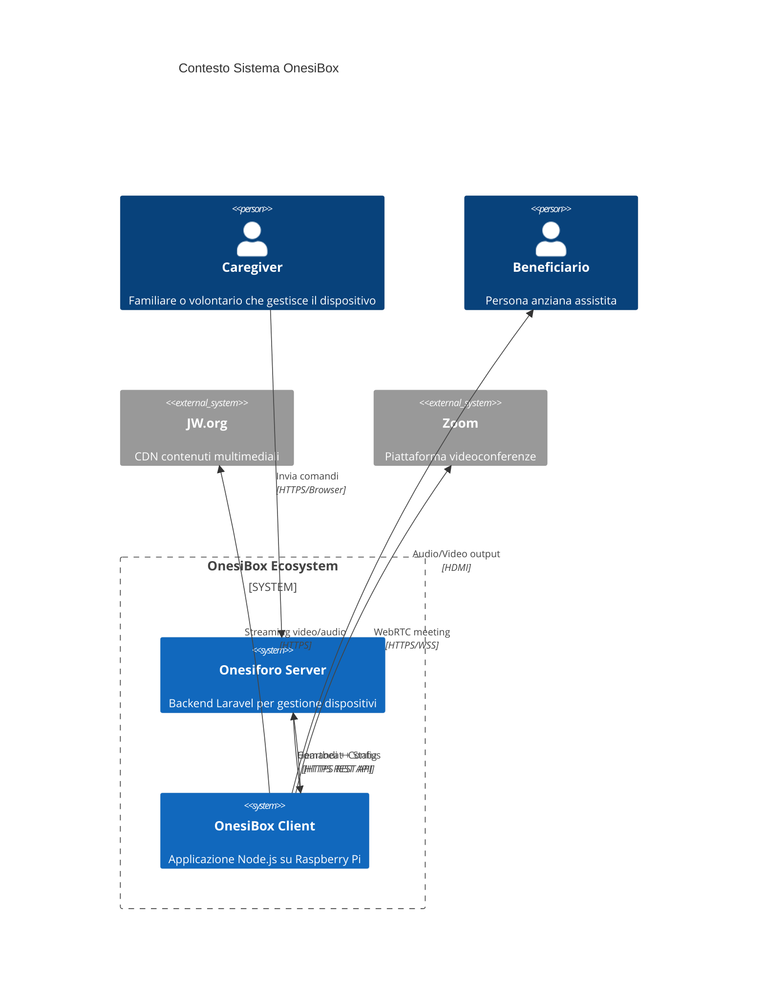
```mermaid
C4Context
    title Contesto Sistema OnesiBox

    Person(caregiver, "Caregiver", "Familiare o volontario che gestisce il dispositivo")
    Person(beneficiario, "Beneficiario", "Persona anziana assistita")

    System_Boundary(onesibox_boundary, "OnesiBox Ecosystem") {
        System(server, "Onesiforo Server", "Backend Laravel per gestione dispositivi")
        System(client, "OnesiBox Client", "Applicazione Node.js su Raspberry Pi")
    }

    System_Ext(jworg, "JW.org", "CDN contenuti multimediali")
    System_Ext(zoom, "Zoom", "Piattaforma videoconferenze")

    Rel(caregiver, server, "Invia comandi", "HTTPS/Browser")
    Rel(server, client, "Comandi + Config", "HTTPS REST API")
    Rel(client, server, "Heartbeat + Status", "HTTPS REST API")
    Rel(client, jworg, "Streaming video/audio", "HTTPS")
    Rel(client, zoom, "WebRTC meeting", "HTTPS/WSS")
    Rel(client, beneficiario, "Audio/Video output", "HDMI")
```

### 1.2 Vincoli Architetturali

| Vincolo | Valore | Impatto |
|---------|--------|---------|
| RAM disponibile | 4GB (Raspberry Pi 5) | Limite consumo: <500MB idle, <1GB durante video |
| Storage | 32GB microSD | Log rotation, no cache persistente pesante |
| CPU | ARM Cortex-A76 quad-core | Operazioni intensive in background |
| Network | WiFi/Ethernet 100Mbps+ | Timeout aggressivi, retry con backoff |
| Uptime | 24/7 | Auto-recovery, watchdog, no memory leaks |
| Interazione utente | Zero | Tutto controllato remotamente |

### 1.3 Decisioni Architetturali (ADR)

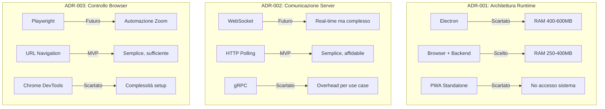
```mermaid
graph TD
    subgraph "ADR-001: Architettura Runtime"
        A1[Electron] -->|Scartato| A1R[RAM 400-600MB]
        A2[Browser + Backend] -->|Scelto| A2R[RAM 250-400MB]
        A3[PWA Standalone] -->|Scartato| A3R[No accesso sistema]
    end

    subgraph "ADR-002: Comunicazione Server"
        B1[WebSocket] -->|Futuro| B1R[Real-time ma complesso]
        B2[HTTP Polling] -->|MVP| B2R[Semplice, affidabile]
        B3[gRPC] -->|Scartato| B3R[Overhead per use case]
    end

    subgraph "ADR-003: Controllo Browser"
        C1[Playwright] -->|Futuro| C1R[Automazione Zoom]
        C2[URL Navigation] -->|MVP| C2R[Semplice, sufficiente]
        C3[Chrome DevTools] -->|Scartato| C3R[Complessità setup]
    end
```

---

## 2. Architettura a Livelli

### 2.1 Diagramma Livelli Completo

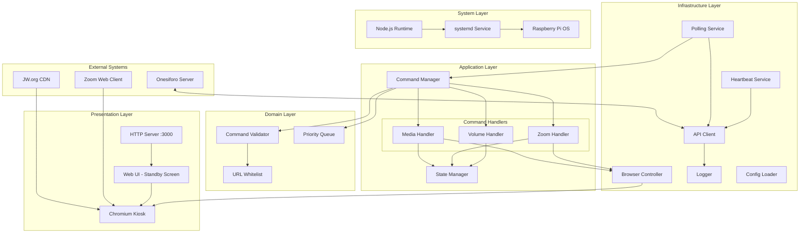
```mermaid
flowchart TB
    subgraph "External Systems"
        EXT_SERVER[Onesiforo Server]
        EXT_MEDIA[JW.org CDN]
        EXT_ZOOM[Zoom Web Client]
    end

    subgraph "Presentation Layer"
        direction LR
        HTTP_SRV[HTTP Server :3000]
        WEB_UI[Web UI - Standby Screen]
        CHROMIUM[Chromium Kiosk]
    end

    subgraph "Application Layer"
        direction LR
        CMD_MGR[Command Manager]
        STATE_MGR[State Manager]

        subgraph "Command Handlers"
            H_MEDIA[Media Handler]
            H_ZOOM[Zoom Handler]
            H_VOL[Volume Handler]
        end
    end

    subgraph "Domain Layer"
        direction LR
        VALIDATOR[Command Validator]
        URL_WL[URL Whitelist]
        PRIORITY[Priority Queue]
    end

    subgraph "Infrastructure Layer"
        direction LR
        API_CLIENT[API Client]
        POLLING[Polling Service]
        HEARTBEAT[Heartbeat Service]
        BROWSER_CTRL[Browser Controller]
        LOGGER[Logger]
        CONFIG[Config Loader]
    end

    subgraph "System Layer"
        direction LR
        NODE[Node.js Runtime]
        SYSTEMD[systemd Service]
        OS[Raspberry Pi OS]
    end

    %% Connections
    EXT_SERVER <--> API_CLIENT
    EXT_MEDIA --> CHROMIUM
    EXT_ZOOM --> CHROMIUM

    HTTP_SRV --> WEB_UI
    WEB_UI --> CHROMIUM

    POLLING --> CMD_MGR
    CMD_MGR --> VALIDATOR
    CMD_MGR --> H_MEDIA
    CMD_MGR --> H_ZOOM
    CMD_MGR --> H_VOL

    H_MEDIA --> STATE_MGR
    H_MEDIA --> BROWSER_CTRL
    H_ZOOM --> STATE_MGR
    H_ZOOM --> BROWSER_CTRL
    H_VOL --> STATE_MGR

    VALIDATOR --> URL_WL
    CMD_MGR --> PRIORITY

    API_CLIENT --> LOGGER
    POLLING --> API_CLIENT
    HEARTBEAT --> API_CLIENT
    BROWSER_CTRL --> CHROMIUM

    NODE --> SYSTEMD
    SYSTEMD --> OS
```

### 2.2 Responsabilità dei Livelli

#### Presentation Layer

| Componente | File | Responsabilità |
|------------|------|----------------|
| HTTP Server | `main.js` (integrato) | Serve file statici e API status |
| Web UI | `web/*` | Interfaccia standby con orologio e indicatori |
| Chromium | Sistema | Rendering contenuti e WebRTC |

#### Application Layer

| Componente | File | Responsabilità |
|------------|------|----------------|
| Command Manager | `commands/manager.js` | Dispatch e orchestrazione comandi |
| State Manager | `state/state-manager.js` | Stato applicazione e transizioni |
| Handlers | `commands/handlers/*` | Logica business per ogni tipo comando |

#### Domain Layer

| Componente | File | Responsabilità |
|------------|------|----------------|
| Validator | `commands/validator.js` | Validazione struttura e payload |
| URL Whitelist | `commands/validator.js` | Autorizzazione domini media |
| Priority Queue | `commands/manager.js` | Ordinamento comandi per priorità |

#### Infrastructure Layer

| Componente | File | Responsabilità |
|------------|------|----------------|
| API Client | `communication/api-client.js` | Comunicazione HTTP con server |
| Polling | `communication/polling.js` | Fetch periodico comandi |
| Heartbeat | `communication/heartbeat.js` | Invio metriche periodiche |
| Browser Controller | `browser/controller.js` | Controllo Chromium via shell |
| Logger | `logging/logger.js` | Logging strutturato con rotation |
| Config | `config/config.js` | Caricamento e validazione config |

---

## 3. Diagrammi di Sequenza Dettagliati

### 3.1 Startup Completo

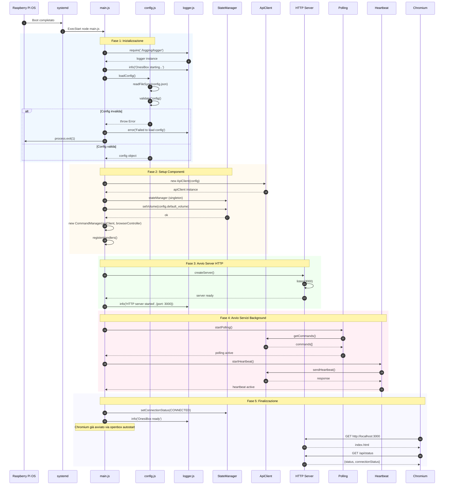
```mermaid
sequenceDiagram
    autonumber
    participant OS as Raspberry Pi OS
    participant SD as systemd
    participant MAIN as main.js
    participant CFG as config.js
    participant LOG as logger.js
    participant STATE as StateManager
    participant API as ApiClient
    participant HTTP as HTTP Server
    participant POLL as Polling
    participant HB as Heartbeat
    participant CHROME as Chromium

    OS->>SD: Boot completato
    SD->>MAIN: ExecStart node main.js

    rect rgb(240, 248, 255)
        Note over MAIN,CFG: Fase 1: Inizializzazione
        MAIN->>LOG: require('./logging/logger')
        LOG-->>MAIN: logger instance
        MAIN->>LOG: info('OnesiBox starting...')

        MAIN->>CFG: loadConfig()
        CFG->>CFG: readFileSync(config.json)
        CFG->>CFG: validateConfig()
        alt Config invalida
            CFG-->>MAIN: throw Error
            MAIN->>LOG: error('Failed to load config')
            MAIN->>OS: process.exit(1)
        else Config valida
            CFG-->>MAIN: config object
        end
    end

    rect rgb(255, 250, 240)
        Note over MAIN,STATE: Fase 2: Setup Componenti
        MAIN->>API: new ApiClient(config)
        API-->>MAIN: apiClient instance

        MAIN->>STATE: stateManager (singleton)
        MAIN->>STATE: setVolume(config.default_volume)
        STATE-->>MAIN: ok

        MAIN->>MAIN: new CommandManager(apiClient, browserController)
        MAIN->>MAIN: registerHandlers()
    end

    rect rgb(240, 255, 240)
        Note over MAIN,HTTP: Fase 3: Avvio Server HTTP
        MAIN->>HTTP: createServer()
        HTTP->>HTTP: listen(3000)
        HTTP-->>MAIN: server ready
        MAIN->>LOG: info('HTTP server started', {port: 3000})
    end

    rect rgb(255, 240, 245)
        Note over MAIN,HB: Fase 4: Avvio Servizi Background
        MAIN->>POLL: startPolling()
        POLL->>API: getCommands()
        API-->>POLL: commands[]
        POLL-->>MAIN: polling active

        MAIN->>HB: startHeartbeat()
        HB->>API: sendHeartbeat()
        API-->>HB: response
        HB-->>MAIN: heartbeat active
    end

    rect rgb(248, 248, 255)
        Note over MAIN,CHROME: Fase 5: Finalizzazione
        MAIN->>STATE: setConnectionStatus(CONNECTED)
        MAIN->>LOG: info('OnesiBox ready')

        Note over MAIN: Chromium già avviato via openbox autostart
        CHROME->>HTTP: GET http://localhost:3000
        HTTP-->>CHROME: index.html
        CHROME->>HTTP: GET /api/status
        HTTP-->>CHROME: {status, connectionStatus}
    end
```

### 3.2 Ciclo di Polling Dettagliato

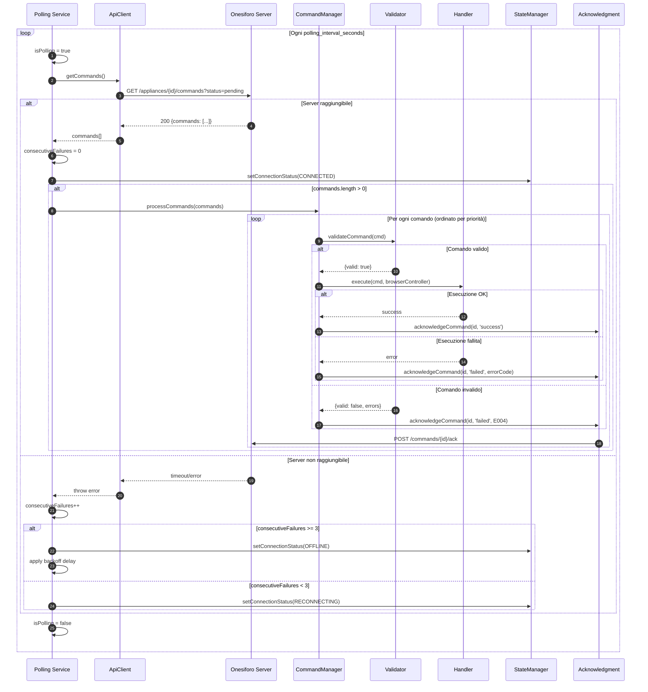
```mermaid
sequenceDiagram
    autonumber
    participant POLL as Polling Service
    participant API as ApiClient
    participant SRV as Onesiforo Server
    participant CMD as CommandManager
    participant VAL as Validator
    participant HAND as Handler
    participant STATE as StateManager
    participant ACK as Acknowledgment

    loop Ogni polling_interval_seconds
        POLL->>POLL: isPolling = true

        POLL->>API: getCommands()
        API->>SRV: GET /appliances/{id}/commands?status=pending

        alt Server raggiungibile
            SRV-->>API: 200 {commands: [...]}
            API-->>POLL: commands[]
            POLL->>POLL: consecutiveFailures = 0
            POLL->>STATE: setConnectionStatus(CONNECTED)

            alt commands.length > 0
                POLL->>CMD: processCommands(commands)

                loop Per ogni comando (ordinato per priorità)
                    CMD->>VAL: validateCommand(cmd)

                    alt Comando valido
                        VAL-->>CMD: {valid: true}
                        CMD->>HAND: execute(cmd, browserController)

                        alt Esecuzione OK
                            HAND-->>CMD: success
                            CMD->>ACK: acknowledgeCommand(id, 'success')
                        else Esecuzione fallita
                            HAND-->>CMD: error
                            CMD->>ACK: acknowledgeCommand(id, 'failed', errorCode)
                        end
                    else Comando invalido
                        VAL-->>CMD: {valid: false, errors}
                        CMD->>ACK: acknowledgeCommand(id, 'failed', E004)
                    end

                    ACK->>SRV: POST /commands/{id}/ack
                end
            end

        else Server non raggiungibile
            SRV-->>API: timeout/error
            API-->>POLL: throw error
            POLL->>POLL: consecutiveFailures++

            alt consecutiveFailures >= 3
                POLL->>STATE: setConnectionStatus(OFFLINE)
                POLL->>POLL: apply backoff delay
            else consecutiveFailures < 3
                POLL->>STATE: setConnectionStatus(RECONNECTING)
            end
        end

        POLL->>POLL: isPolling = false
    end
```

### 3.3 Esecuzione play_media

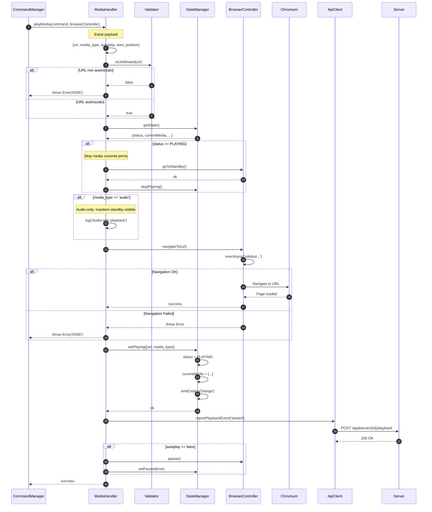
```mermaid
sequenceDiagram
    autonumber
    participant CMD as CommandManager
    participant MEDIA as MediaHandler
    participant VAL as Validator
    participant STATE as StateManager
    participant CTRL as BrowserController
    participant CHROME as Chromium
    participant API as ApiClient
    participant SRV as Server

    CMD->>MEDIA: playMedia(command, browserController)

    Note over MEDIA: Estrai payload
    MEDIA->>MEDIA: {url, media_type, autoplay, start_position}

    MEDIA->>VAL: isUrlAllowed(url)
    alt URL non autorizzato
        VAL-->>MEDIA: false
        MEDIA-->>CMD: throw Error('E005')
    else URL autorizzato
        VAL-->>MEDIA: true
    end

    MEDIA->>STATE: getState()
    STATE-->>MEDIA: {status, currentMedia, ...}

    alt status == PLAYING
        Note over MEDIA: Stop media corrente prima
        MEDIA->>CTRL: goToStandby()
        CTRL-->>MEDIA: ok
        MEDIA->>STATE: stopPlaying()
    end

    alt media_type == 'audio'
        Note over MEDIA: Audio-only: mantieni standby visibile
        MEDIA->>MEDIA: log('Audio-only playback')
    end

    MEDIA->>CTRL: navigateTo(url)
    CTRL->>CTRL: execAsync('xdotool...')

    alt Navigation OK
        CTRL->>CHROME: Navigate to URL
        CHROME-->>CTRL: Page loaded
        CTRL-->>MEDIA: success
    else Navigation Failed
        CTRL-->>MEDIA: throw Error
        MEDIA-->>CMD: throw Error('E006')
    end

    MEDIA->>STATE: setPlaying({url, media_type})
    STATE->>STATE: status = PLAYING
    STATE->>STATE: currentMedia = {...}
    STATE->>STATE: emit('statusChange')
    STATE-->>MEDIA: ok

    MEDIA->>API: reportPlaybackEvent('started')
    API->>SRV: POST /appliances/{id}/playback
    SRV-->>API: 200 OK

    alt autoplay == false
        MEDIA->>CTRL: pause()
        MEDIA->>STATE: setPaused(true)
    end

    MEDIA-->>CMD: success
```

### 3.4 Priorità e Interruzione (join_zoom durante playback)

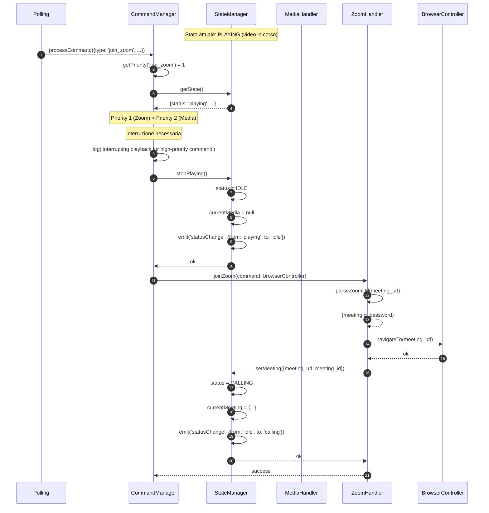
```mermaid
sequenceDiagram
    autonumber
    participant POLL as Polling
    participant CMD as CommandManager
    participant STATE as StateManager
    participant MEDIA as MediaHandler
    participant ZOOM as ZoomHandler
    participant CTRL as BrowserController

    Note over STATE: Stato attuale: PLAYING (video in corso)

    POLL->>CMD: processCommand({type: 'join_zoom', ...})

    CMD->>CMD: getPriority('join_zoom') = 1
    CMD->>STATE: getState()
    STATE-->>CMD: {status: 'playing', ...}

    Note over CMD: Priority 1 (Zoom) > Priority 2 (Media)
    Note over CMD: Interruzione necessaria

    CMD->>CMD: log('Interrupting playback for high-priority command')

    CMD->>STATE: stopPlaying()
    STATE->>STATE: status = IDLE
    STATE->>STATE: currentMedia = null
    STATE->>STATE: emit('statusChange', {from: 'playing', to: 'idle'})
    STATE-->>CMD: ok

    CMD->>ZOOM: joinZoom(command, browserController)

    ZOOM->>ZOOM: parseZoomUrl(meeting_url)
    ZOOM-->>ZOOM: {meetingId, password}

    ZOOM->>CTRL: navigateTo(meeting_url)
    CTRL-->>ZOOM: ok

    ZOOM->>STATE: setMeeting({meeting_url, meeting_id})
    STATE->>STATE: status = CALLING
    STATE->>STATE: currentMeeting = {...}
    STATE->>STATE: emit('statusChange', {from: 'idle', to: 'calling'})
    STATE-->>ZOOM: ok

    ZOOM-->>CMD: success
```

---

## 4. Modello dei Dati

### 4.1 Diagramma Entità

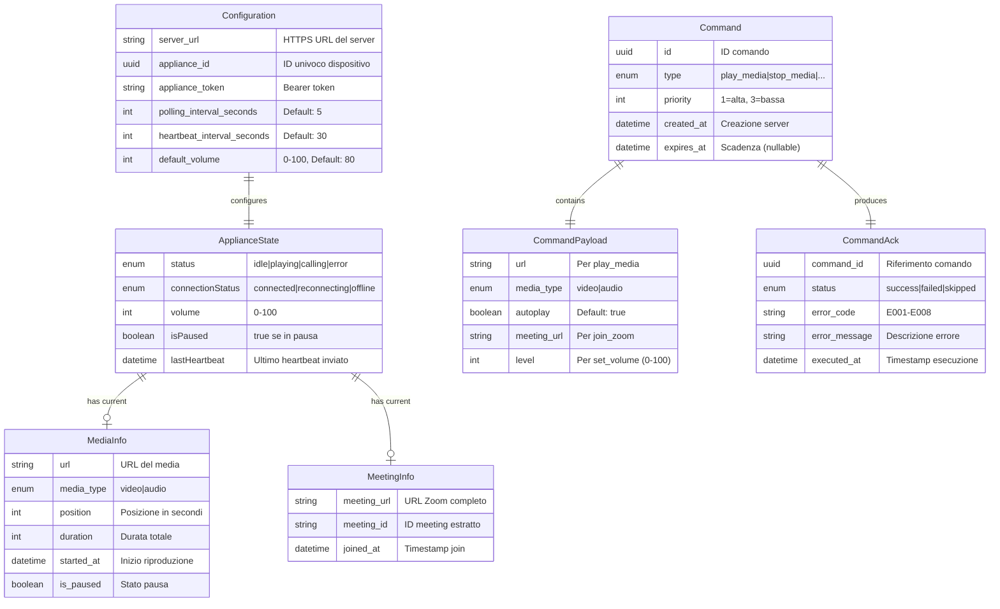
```mermaid
erDiagram
    Configuration ||--|| ApplianceState : configures
    ApplianceState ||--o| MediaInfo : "has current"
    ApplianceState ||--o| MeetingInfo : "has current"
    Command ||--|| CommandPayload : contains
    Command ||--|| CommandAck : produces

    Configuration {
        string server_url "HTTPS URL del server"
        uuid appliance_id "ID univoco dispositivo"
        string appliance_token "Bearer token"
        int polling_interval_seconds "Default: 5"
        int heartbeat_interval_seconds "Default: 30"
        int default_volume "0-100, Default: 80"
    }

    ApplianceState {
        enum status "idle|playing|calling|error"
        enum connectionStatus "connected|reconnecting|offline"
        int volume "0-100"
        boolean isPaused "true se in pausa"
        datetime lastHeartbeat "Ultimo heartbeat inviato"
    }

    MediaInfo {
        string url "URL del media"
        enum media_type "video|audio"
        int position "Posizione in secondi"
        int duration "Durata totale"
        datetime started_at "Inizio riproduzione"
        boolean is_paused "Stato pausa"
    }

    MeetingInfo {
        string meeting_url "URL Zoom completo"
        string meeting_id "ID meeting estratto"
        datetime joined_at "Timestamp join"
    }

    Command {
        uuid id "ID comando"
        enum type "play_media|stop_media|..."
        int priority "1=alta, 3=bassa"
        datetime created_at "Creazione server"
        datetime expires_at "Scadenza (nullable)"
    }

    CommandPayload {
        string url "Per play_media"
        enum media_type "video|audio"
        boolean autoplay "Default: true"
        string meeting_url "Per join_zoom"
        int level "Per set_volume (0-100)"
    }

    CommandAck {
        uuid command_id "Riferimento comando"
        enum status "success|failed|skipped"
        string error_code "E001-E008"
        string error_message "Descrizione errore"
        datetime executed_at "Timestamp esecuzione"
    }
```

### 4.2 Schema Configurazione (JSON Schema)

```json
{
  "$schema": "http://json-schema.org/draft-07/schema#",
  "type": "object",
  "required": ["server_url", "appliance_id", "appliance_token"],
  "properties": {
    "server_url": {
      "type": "string",
      "format": "uri",
      "pattern": "^https://"
    },
    "appliance_id": {
      "type": "string",
      "format": "uuid"
    },
    "appliance_token": {
      "type": "string",
      "minLength": 1
    },
    "polling_interval_seconds": {
      "type": "integer",
      "minimum": 1,
      "default": 5
    },
    "heartbeat_interval_seconds": {
      "type": "integer",
      "minimum": 10,
      "default": 30
    },
    "default_volume": {
      "type": "integer",
      "minimum": 0,
      "maximum": 100,
      "default": 80
    }
  }
}
```

### 4.3 State Machine Formale

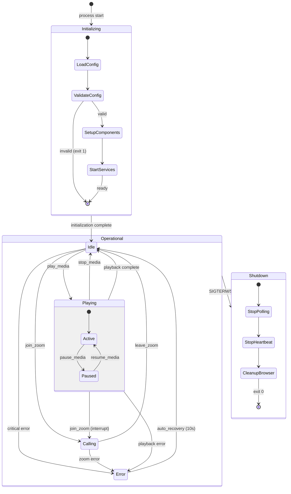
```mermaid
stateDiagram-v2
    [*] --> Initializing: process start

    state Initializing {
        [*] --> LoadConfig
        LoadConfig --> ValidateConfig
        ValidateConfig --> SetupComponents: valid
        ValidateConfig --> [*]: invalid (exit 1)
        SetupComponents --> StartServices
        StartServices --> [*]: ready
    }

    Initializing --> Idle: initialization complete

    state Operational {
        Idle --> Playing: play_media
        Idle --> Calling: join_zoom
        Idle --> Error: critical error

        Playing --> Idle: stop_media
        Playing --> Idle: playback complete
        Playing --> Calling: join_zoom (interrupt)
        Playing --> Error: playback error

        state Playing {
            [*] --> Active
            Active --> Paused: pause_media
            Paused --> Active: resume_media
        }

        Calling --> Idle: leave_zoom
        Calling --> Error: zoom error

        Error --> Idle: auto_recovery (10s)
    }

    Operational --> Shutdown: SIGTERM/SIGINT

    state Shutdown {
        [*] --> StopPolling
        StopPolling --> StopHeartbeat
        StopHeartbeat --> CleanupBrowser
        CleanupBrowser --> [*]: exit 0
    }
```

---

## 5. Pattern Implementati

### 5.1 Singleton Pattern (State Manager)

Il State Manager è implementato come singleton per garantire una singola fonte di verità sullo stato dell'applicazione.

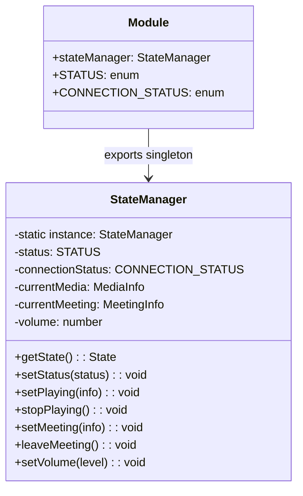
```mermaid
classDiagram
    class StateManager {
        -static instance: StateManager
        -status: STATUS
        -connectionStatus: CONNECTION_STATUS
        -currentMedia: MediaInfo
        -currentMeeting: MeetingInfo
        -volume: number

        +getState(): State
        +setStatus(status): void
        +setPlaying(info): void
        +stopPlaying(): void
        +setMeeting(info): void
        +leaveMeeting(): void
        +setVolume(level): void
    }

    class Module {
        +stateManager: StateManager
        +STATUS: enum
        +CONNECTION_STATUS: enum
    }

    Module --> StateManager: exports singleton
```

**Implementazione:**

```javascript
// state-manager.js
class StateManager extends EventEmitter {
  constructor() {
    super();
    // inizializzazione...
  }
}

// Singleton export
const stateManager = new StateManager();
module.exports = { stateManager, STATUS, CONNECTION_STATUS };
```

### 5.2 Strategy Pattern (Command Handlers)

Ogni tipo di comando è gestito da un handler specifico, registrato dinamicamente.

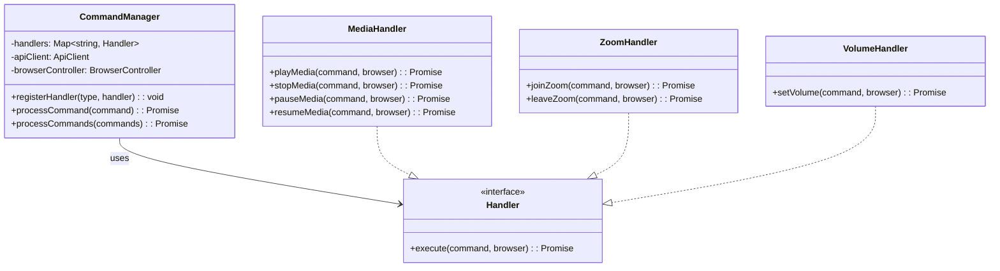
```mermaid
classDiagram
    class CommandManager {
        -handlers: Map~string, Handler~
        -apiClient: ApiClient
        -browserController: BrowserController

        +registerHandler(type, handler): void
        +processCommand(command): Promise
        +processCommands(commands): Promise
    }

    class Handler {
        <<interface>>
        +execute(command, browser): Promise
    }

    class MediaHandler {
        +playMedia(command, browser): Promise
        +stopMedia(command, browser): Promise
        +pauseMedia(command, browser): Promise
        +resumeMedia(command, browser): Promise
    }

    class ZoomHandler {
        +joinZoom(command, browser): Promise
        +leaveZoom(command, browser): Promise
    }

    class VolumeHandler {
        +setVolume(command, browser): Promise
    }

    CommandManager --> Handler: uses
    MediaHandler ..|> Handler
    ZoomHandler ..|> Handler
    VolumeHandler ..|> Handler
```

### 5.3 Observer Pattern (Event Emitter)

Il State Manager notifica i cambiamenti di stato tramite eventi.

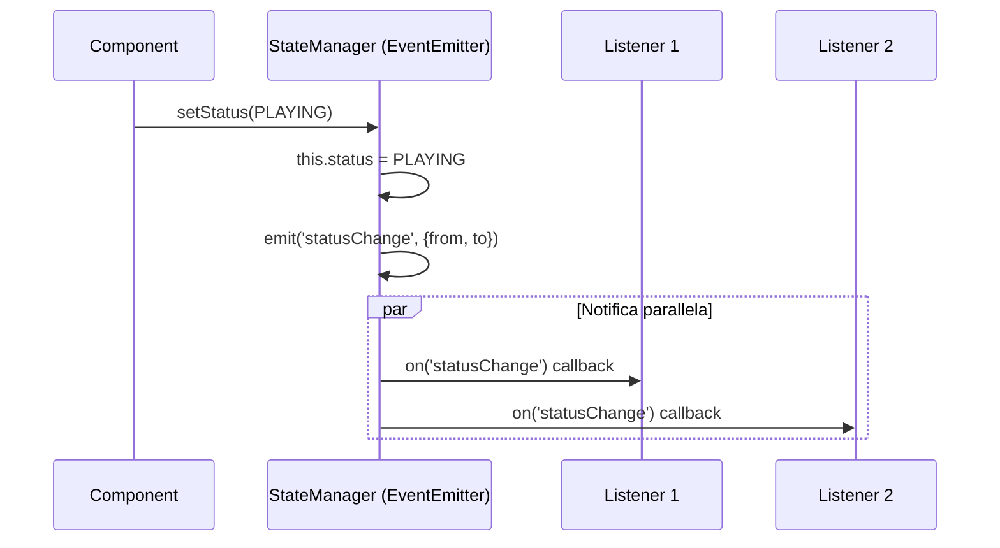
```mermaid
sequenceDiagram
    participant C as Component
    participant SM as StateManager (EventEmitter)
    participant L1 as Listener 1
    participant L2 as Listener 2

    C->>SM: setStatus(PLAYING)
    SM->>SM: this.status = PLAYING
    SM->>SM: emit('statusChange', {from, to})

    par Notifica parallela
        SM->>L1: on('statusChange') callback
        SM->>L2: on('statusChange') callback
    end
```

### 5.4 Circuit Breaker (Backoff Esponenziale)

Per gestire fallimenti di rete con retry progressivo.

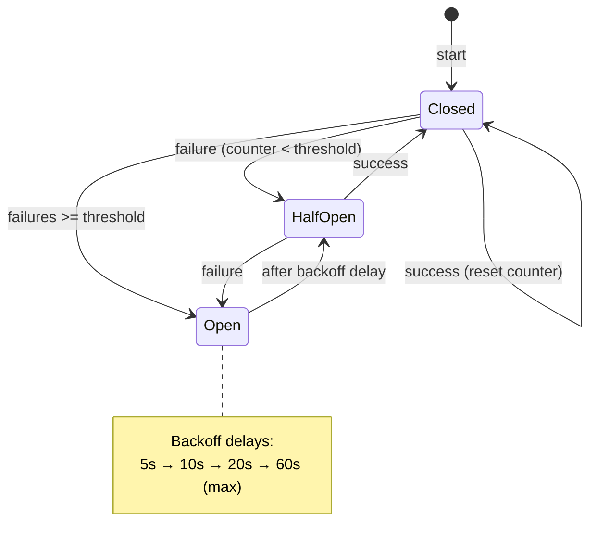
```mermaid
stateDiagram-v2
    [*] --> Closed: start

    Closed --> Closed: success (reset counter)
    Closed --> HalfOpen: failure (counter < threshold)
    Closed --> Open: failures >= threshold

    HalfOpen --> Closed: success
    HalfOpen --> Open: failure

    Open --> HalfOpen: after backoff delay

    note right of Open
        Backoff delays:
        5s → 10s → 20s → 60s (max)
    end note
```

**Implementazione:**

```javascript
const BACKOFF_SCHEDULE = [5000, 10000, 20000, 60000];

async function pollWithBackoff() {
  try {
    await poll();
    consecutiveFailures = 0;
  } catch {
    consecutiveFailures++;
    const delay = BACKOFF_SCHEDULE[
      Math.min(consecutiveFailures - 1, BACKOFF_SCHEDULE.length - 1)
    ];
    await sleep(delay);
  }
}
```

---

## 6. API Contracts

### 6.1 Endpoint Consumati dal Client

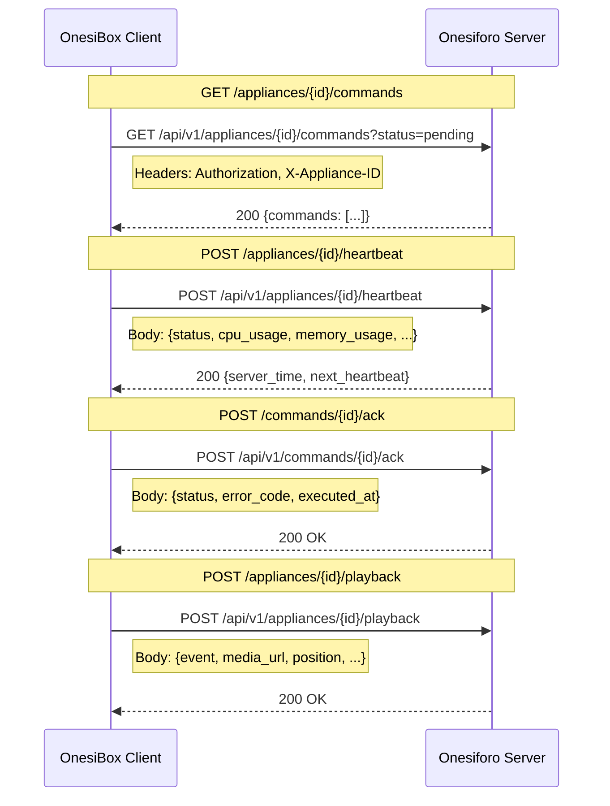
```mermaid
sequenceDiagram
    participant C as OnesiBox Client
    participant S as Onesiforo Server

    Note over C,S: GET /appliances/{id}/commands
    C->>S: GET /api/v1/appliances/{id}/commands?status=pending
    Note right of C: Headers: Authorization, X-Appliance-ID
    S-->>C: 200 {commands: [...]}

    Note over C,S: POST /appliances/{id}/heartbeat
    C->>S: POST /api/v1/appliances/{id}/heartbeat
    Note right of C: Body: {status, cpu_usage, memory_usage, ...}
    S-->>C: 200 {server_time, next_heartbeat}

    Note over C,S: POST /commands/{id}/ack
    C->>S: POST /api/v1/commands/{id}/ack
    Note right of C: Body: {status, error_code, executed_at}
    S-->>C: 200 OK

    Note over C,S: POST /appliances/{id}/playback
    C->>S: POST /api/v1/appliances/{id}/playback
    Note right of C: Body: {event, media_url, position, ...}
    S-->>C: 200 OK
```

### 6.2 Struttura Headers

```
Authorization: Bearer {appliance_token}
X-Appliance-ID: {appliance_uuid}
Content-Type: application/json
```

### 6.3 Payload Comandi per Tipo

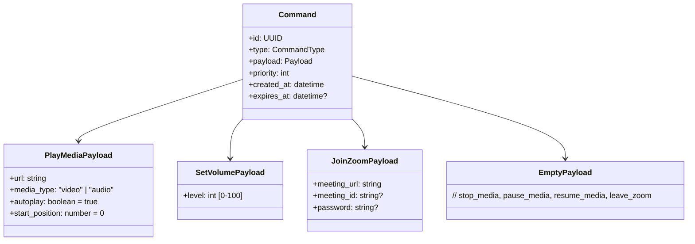
```mermaid
classDiagram
    class Command {
        +id: UUID
        +type: CommandType
        +payload: Payload
        +priority: int
        +created_at: datetime
        +expires_at: datetime?
    }

    class PlayMediaPayload {
        +url: string
        +media_type: "video" | "audio"
        +autoplay: boolean = true
        +start_position: number = 0
    }

    class SetVolumePayload {
        +level: int [0-100]
    }

    class JoinZoomPayload {
        +meeting_url: string
        +meeting_id: string?
        +password: string?
    }

    class EmptyPayload {
        // stop_media, pause_media, resume_media, leave_zoom
    }

    Command --> PlayMediaPayload
    Command --> SetVolumePayload
    Command --> JoinZoomPayload
    Command --> EmptyPayload
```

---

## 7. Gestione degli Errori

### 7.1 Gerarchia Errori

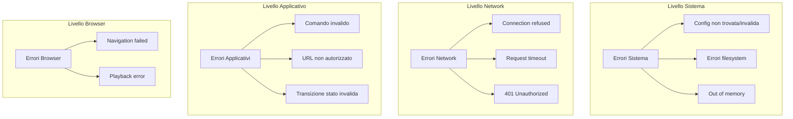
```mermaid
flowchart TB
    subgraph "Livello Sistema"
        E_SYS[Errori Sistema]
        E_SYS --> E_CONFIG[Config non trovata/invalida]
        E_SYS --> E_FS[Errori filesystem]
        E_SYS --> E_MEM[Out of memory]
    end

    subgraph "Livello Network"
        E_NET[Errori Network]
        E_NET --> E_CONN[Connection refused]
        E_NET --> E_TIMEOUT[Request timeout]
        E_NET --> E_AUTH[401 Unauthorized]
    end

    subgraph "Livello Applicativo"
        E_APP[Errori Applicativi]
        E_APP --> E_CMD[Comando invalido]
        E_APP --> E_URL[URL non autorizzato]
        E_APP --> E_STATE[Transizione stato invalida]
    end

    subgraph "Livello Browser"
        E_BROWSER[Errori Browser]
        E_BROWSER --> E_NAV[Navigation failed]
        E_BROWSER --> E_MEDIA[Playback error]
    end
```

### 7.2 Codici Errore

| Codice | Nome | Descrizione | Azione Recovery |
|--------|------|-------------|-----------------|
| E001 | CONNECTION_ERROR | Server non raggiungibile | Backoff + retry |
| E002 | AUTH_ERROR | Token non valido | Log + richiesta nuovo token |
| E003 | UNKNOWN_COMMAND | Tipo comando sconosciuto | ACK failed + log |
| E004 | INVALID_PAYLOAD | Payload non valido | ACK failed + log |
| E005 | URL_NOT_WHITELISTED | URL non autorizzato | ACK failed + log |
| E006 | MEDIA_ERROR | Errore riproduzione | Stop media + standby |
| E007 | ZOOM_ERROR | Errore Zoom | Leave + standby |
| E008 | VOLUME_ERROR | Errore ALSA | Log warning |

### 7.3 Flusso Recovery Automatico

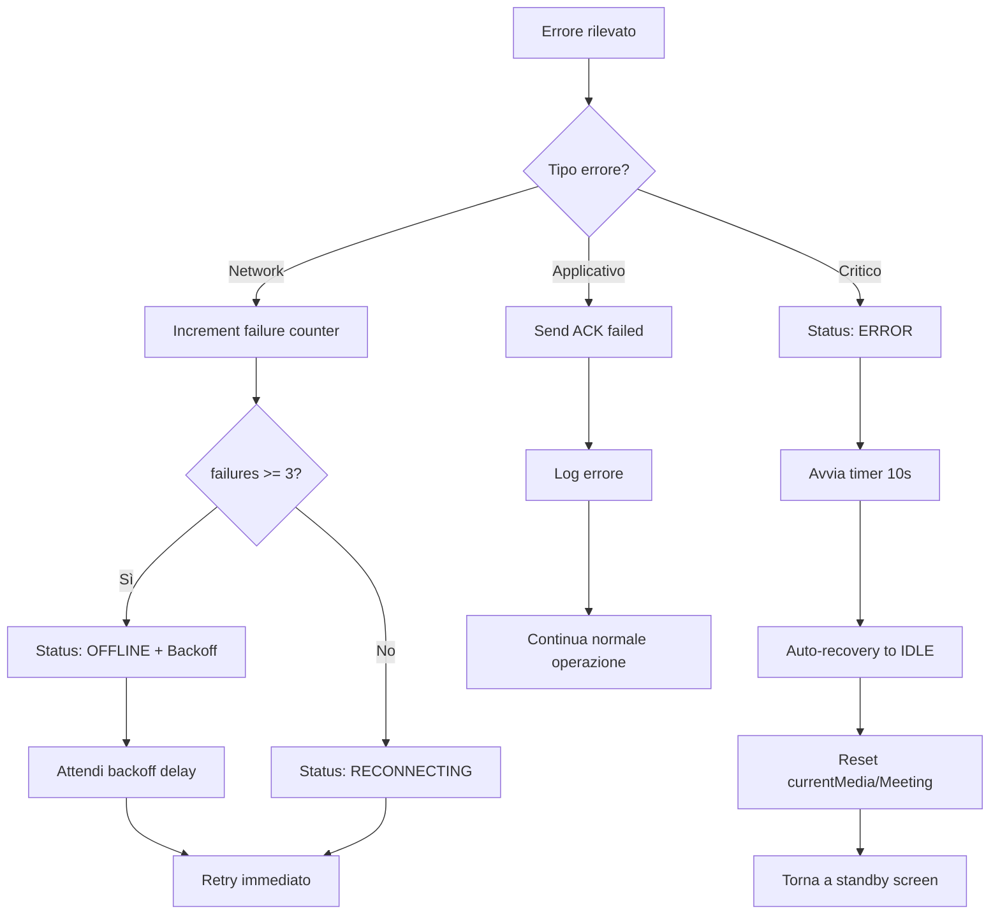
```mermaid
flowchart TD
    START[Errore rilevato] --> CLASSIFY{Tipo errore?}

    CLASSIFY -->|Network| NET_RETRY[Increment failure counter]
    NET_RETRY --> NET_CHECK{failures >= 3?}
    NET_CHECK -->|Sì| OFFLINE[Status: OFFLINE + Backoff]
    NET_CHECK -->|No| RECONNECTING[Status: RECONNECTING]
    OFFLINE --> BACKOFF_WAIT[Attendi backoff delay]
    RECONNECTING --> RETRY[Retry immediato]
    BACKOFF_WAIT --> RETRY

    CLASSIFY -->|Applicativo| APP_ACK[Send ACK failed]
    APP_ACK --> APP_LOG[Log errore]
    APP_LOG --> CONTINUE[Continua normale operazione]

    CLASSIFY -->|Critico| ERROR_STATE[Status: ERROR]
    ERROR_STATE --> TIMER[Avvia timer 10s]
    TIMER --> AUTO_RECOVER[Auto-recovery to IDLE]
    AUTO_RECOVER --> RESET[Reset currentMedia/Meeting]
    RESET --> STANDBY[Torna a standby screen]
```

---

## 8. Sicurezza

### 8.1 Threat Model

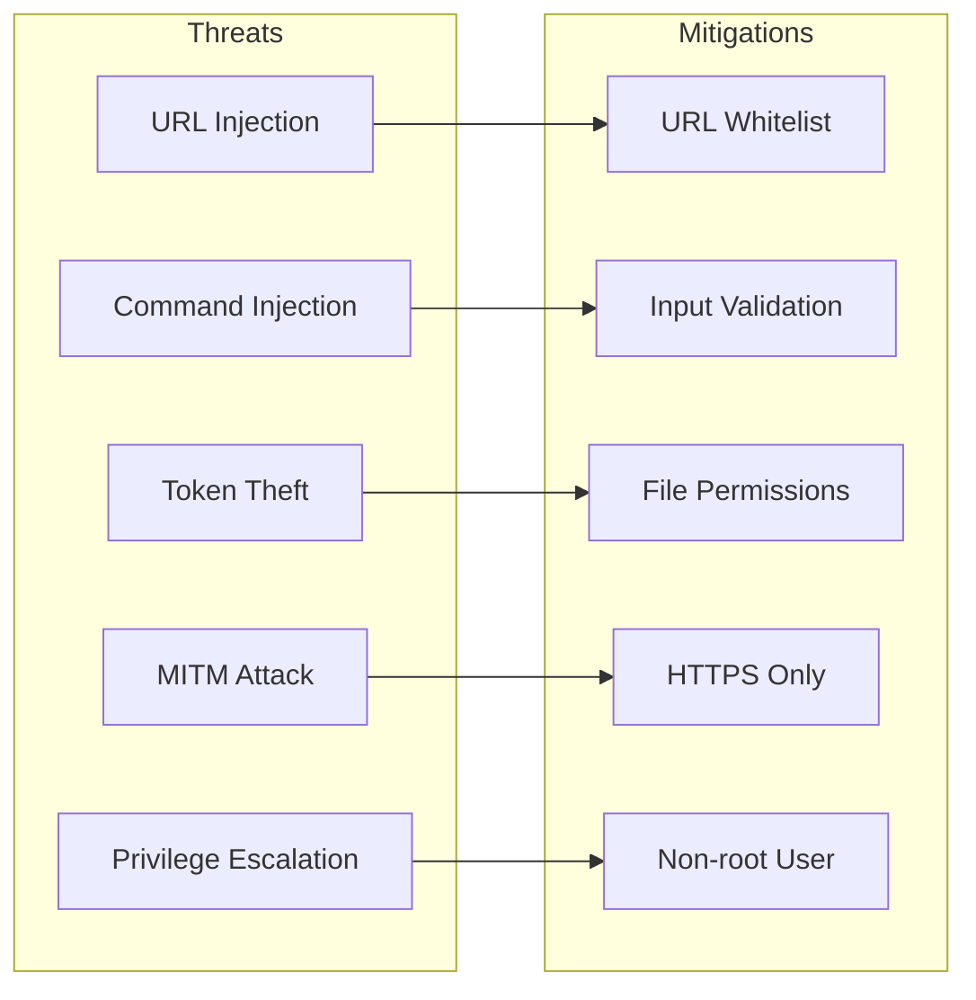
```mermaid
flowchart LR
    subgraph "Threats"
        T1[URL Injection]
        T2[Command Injection]
        T3[Token Theft]
        T4[MITM Attack]
        T5[Privilege Escalation]
    end

    subgraph "Mitigations"
        M1[URL Whitelist]
        M2[Input Validation]
        M3[File Permissions]
        M4[HTTPS Only]
        M5[Non-root User]
    end

    T1 --> M1
    T2 --> M2
    T3 --> M3
    T4 --> M4
    T5 --> M5
```

### 8.2 Whitelist Domini

```javascript
// Domini autorizzati per navigazione
const ALLOWED_DOMAINS = [
  'jw.org',           // Main site
  'www.jw.org',       // WWW variant
  'wol.jw.org',       // Online library
  'download-a.akamaihd.net'  // CDN
];

const ALLOWED_PATTERNS = [
  /^[a-z0-9-]+\.jw-cdn\.org$/  // JW CDN subdomains
];

// Solo per Zoom
const ZOOM_DOMAINS = [
  'zoom.us',
  /\.zoom\.us$/
];
```

### 8.3 Validazione Input

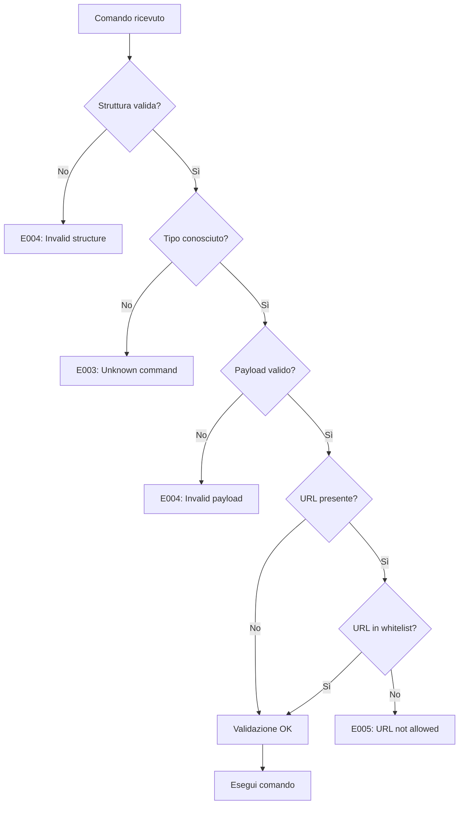
```mermaid
flowchart TD
    INPUT[Comando ricevuto] --> CHECK_STRUCT{Struttura valida?}

    CHECK_STRUCT -->|No| REJECT_STRUCT[E004: Invalid structure]
    CHECK_STRUCT -->|Sì| CHECK_TYPE{Tipo conosciuto?}

    CHECK_TYPE -->|No| REJECT_TYPE[E003: Unknown command]
    CHECK_TYPE -->|Sì| CHECK_PAYLOAD{Payload valido?}

    CHECK_PAYLOAD -->|No| REJECT_PAYLOAD[E004: Invalid payload]
    CHECK_PAYLOAD -->|Sì| CHECK_URL{URL presente?}

    CHECK_URL -->|No| PASS[Validazione OK]
    CHECK_URL -->|Sì| CHECK_WHITELIST{URL in whitelist?}

    CHECK_WHITELIST -->|No| REJECT_URL[E005: URL not allowed]
    CHECK_WHITELIST -->|Sì| PASS

    PASS --> EXECUTE[Esegui comando]
```

---

## 9. Performance e Ottimizzazioni

### 9.1 Memory Budget

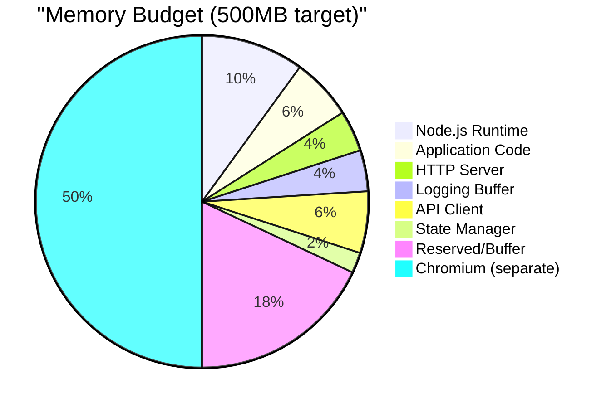
```mermaid
pie title "Memory Budget (500MB target)"
    "Node.js Runtime" : 50
    "Application Code" : 30
    "HTTP Server" : 20
    "Logging Buffer" : 20
    "API Client" : 30
    "State Manager" : 10
    "Reserved/Buffer" : 90
    "Chromium (separate)" : 250
```

### 9.2 Ottimizzazioni Implementate

| Area | Ottimizzazione | Impatto |
|------|----------------|---------|
| Logging | Rotation 50MB max, 7 giorni | Previene disk full |
| Polling | Backoff esponenziale | Riduce load in errore |
| Heartbeat | Metriche async | Non blocca main thread |
| Browser | Chromium nativo (no Electron) | -200MB RAM |
| Config | Single load at startup | Nessun I/O ripetuto |

### 9.3 Monitoring Metriche

```mermaid
flowchart LR
    subgraph "Raccolta Metriche"
        CPU[CPU Load]
        MEM[Memory Usage]
        DISK[Disk Usage]
        TEMP[Temperature]
        UPTIME[Uptime]
    end

    subgraph "systeminformation"
        SI[systeminformation npm]
    end

    subgraph "Heartbeat Payload"
        HB[Heartbeat JSON]
    end

    CPU --> SI
    MEM --> SI
    DISK --> SI
    TEMP --> SI
    UPTIME --> SI

    SI --> HB
    HB --> SERVER[(Onesiforo Server)]
```

---

## 10. Estensibilità

### 10.1 Aggiungere Nuovo Comando

```mermaid
flowchart TD
    A[1. Definire tipo in COMMAND_TYPES] --> B[2. Aggiungere validazione payload]
    B --> C[3. Creare handler file]
    C --> D[4. Implementare logica]
    D --> E[5. Registrare in main.js]
    E --> F[6. Scrivere test]
    F --> G[7. Aggiornare documentazione]
```

### 10.2 Punti di Estensione

```mermaid
classDiagram
    class ExtensionPoints {
        <<interface>>
    }

    class NewCommandHandler {
        +execute(command, browser): Promise
    }

    class NewBrowserController {
        +navigateTo(url): Promise
        +executeScript(script): Promise
    }

    class NewCommunicationChannel {
        +connect(): Promise
        +send(data): Promise
        +onMessage(callback): void
    }

    ExtensionPoints <|-- NewCommandHandler
    ExtensionPoints <|-- NewBrowserController
    ExtensionPoints <|-- NewCommunicationChannel

    note for NewCommandHandler "Per nuovi tipi di comando\n(es. speak_text, show_message)"
    note for NewBrowserController "Per Playwright automation\no Chrome DevTools Protocol"
    note for NewCommunicationChannel "Per WebSocket real-time\no MQTT IoT"
```

### 10.3 Roadmap Estensioni Future

```mermaid
gantt
    title Roadmap Estensioni OnesiBox
    dateFormat  YYYY-MM
    section Fase 1 - MVP
    Polling HTTP           :done, 2026-01, 1M
    Heartbeat Base         :done, 2026-01, 1M
    Media Playback         :done, 2026-01, 1M
    Zoom Join              :done, 2026-01, 1M

    section Fase 2 - Stabilizzazione
    WebSocket Real-time    :2026-02, 1M
    Playwright Zoom        :2026-02, 1M
    TTS Locale             :2026-03, 1M

    section Fase 3 - Avanzate
    Jitsi Meet             :2026-04, 1M
    Remote Screenshot      :2026-04, 1M
    OTA Updates            :2026-05, 1M
```

---

## Appendice A: Diagramma Deployment

```mermaid
deployment
    node RaspberryPi {
        artifact "Node.js Runtime" as node
        artifact "Chromium Browser" as chrome
        artifact "OnesiBox Application" as app
        database "config.json" as config
        database "logs/" as logs
    }

    node OnesforoServer {
        artifact "Laravel Application" as laravel
        database "PostgreSQL" as db
        artifact "Redis Cache" as redis
    }

    node ExternalServices {
        artifact "JW.org CDN" as jw
        artifact "Zoom Web" as zoom
    }

    app --> node : runs on
    app --> chrome : controls
    app --> config : reads
    app --> logs : writes

    app --> laravel : HTTPS API
    laravel --> db : queries
    laravel --> redis : cache

    chrome --> jw : streams media
    chrome --> zoom : WebRTC
```

---

## Appendice B: Checklist Nuovo Sviluppatore

- [ ] Clonare repository e installare dipendenze
- [ ] Leggere questo documento completamente
- [ ] Configurare `config.json` per ambiente dev
- [ ] Eseguire `npm run dev` e verificare avvio
- [ ] Eseguire `npm test` e verificare test passano
- [ ] Esplorare codice seguendo flusso startup
- [ ] Fare debug di un ciclo polling completo
- [ ] Implementare un comando di test
- [ ] Scrivere unit test per il comando
- [ ] Creare PR con le modifiche

---

## Appendice C: Riferimenti Codice

| Componente | File | Linee chiave |
|------------|------|--------------|
| Entry Point | `src/main.js` | `main()`, `registerHandlers()` |
| State Machine | `src/state/state-manager.js` | `setStatus()`, `setPlaying()` |
| Command Dispatch | `src/commands/manager.js` | `processCommand()` |
| URL Validation | `src/commands/validator.js` | `isUrlAllowed()` |
| Media Handler | `src/commands/handlers/media.js` | `playMedia()`, `stopMedia()` |
| Zoom Handler | `src/commands/handlers/zoom.js` | `joinZoom()`, `leaveZoom()` |
| API Client | `src/communication/api-client.js` | `getCommands()`, `sendHeartbeat()` |
| Polling | `src/communication/polling.js` | `_poll()`, `_onFailure()` |
| Browser Control | `src/browser/controller.js` | `navigateTo()`, `goToStandby()` |
