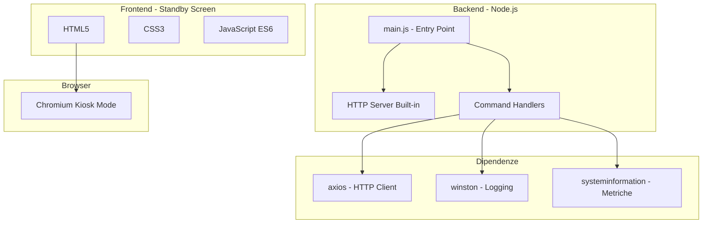
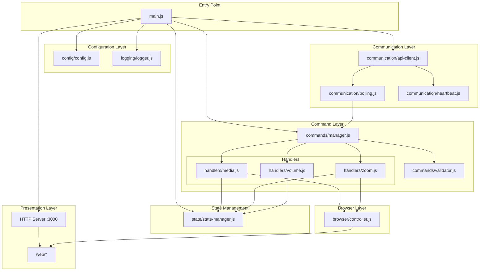
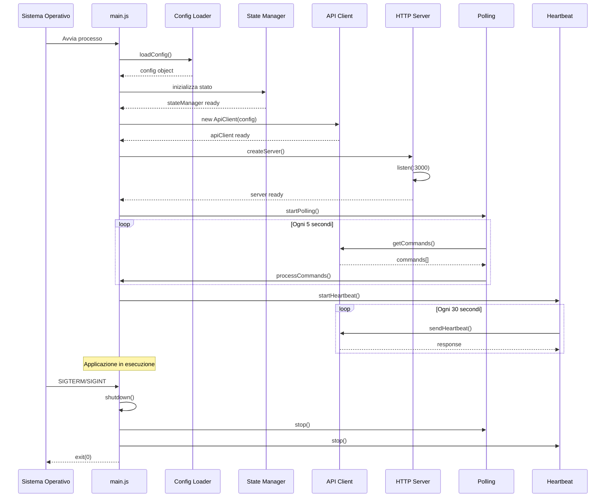
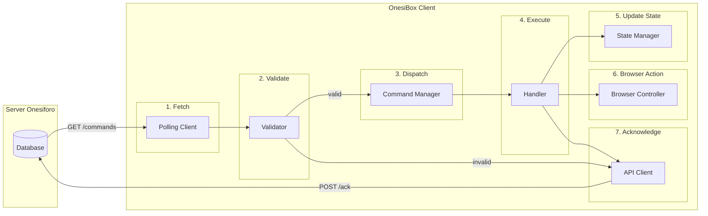
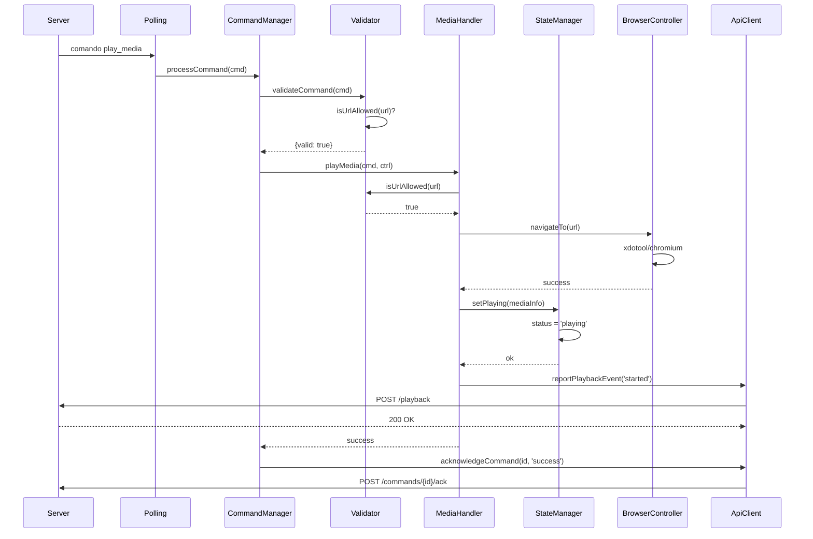
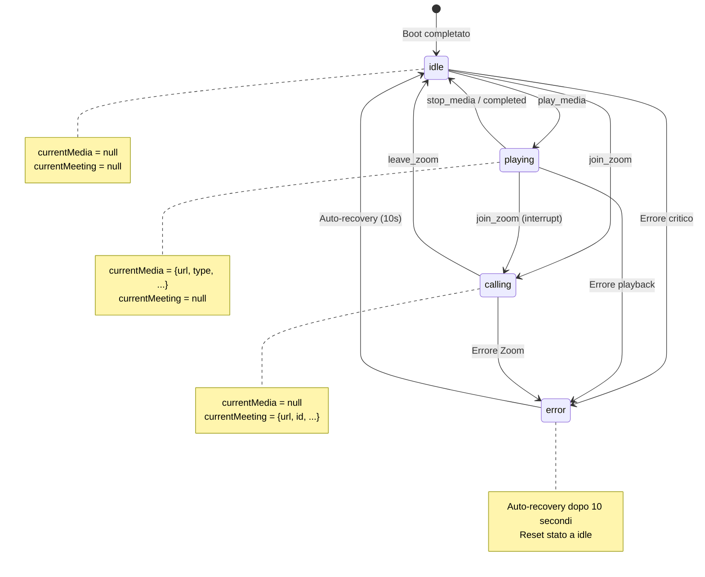
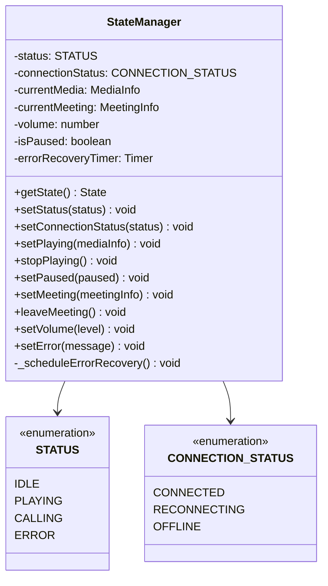
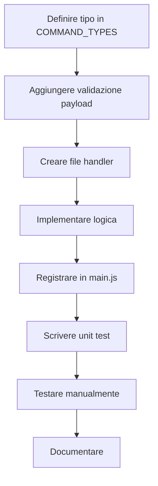

# Guida per lo Sviluppatore OnesiBox

**Versione:** 1.0.0
**Ultimo aggiornamento:** Gennaio 2026

---

## Indice

1. [Introduzione](#1-introduzione)
2. [Setup Ambiente di Sviluppo](#2-setup-ambiente-di-sviluppo)
3. [Architettura del Progetto](#3-architettura-del-progetto)
4. [Flusso dei Dati](#4-flusso-dei-dati)
5. [Componenti Principali](#5-componenti-principali)
6. [Come Aggiungere Nuove Funzionalità](#6-come-aggiungere-nuove-funzionalità)
7. [Testing](#7-testing)
8. [Convenzioni di Codice](#8-convenzioni-di-codice)
9. [Debug e Troubleshooting](#9-debug-e-troubleshooting)
10. [Deployment](#10-deployment)

---

## 1. Introduzione

### 1.1 Cos'è OnesiBox?

OnesiBox è un client software che gira su Raspberry Pi per fornire assistenza remota a persone anziane. Il sistema permette ai caregiver di:

- Riprodurre video/audio da JW.org
- Far partecipare il beneficiario a riunioni Zoom
- Controllare il volume
- Monitorare lo stato del dispositivo

### 1.2 Stack Tecnologico



### 1.3 Prerequisiti

- **Node.js**: 20.x LTS
- **npm**: 10.x+
- **Git**: 2.x+
- **Sistema Operativo**: macOS, Linux, o Windows (per sviluppo)
- **Target**: Raspberry Pi OS Lite 64-bit (Bookworm)

---

## 2. Setup Ambiente di Sviluppo

### 2.1 Clonazione Repository

```bash
git clone https://github.com/onesiphorus-team/onesibox-client.git
cd onesibox-client
```

### 2.2 Installazione Dipendenze

```bash
npm install
```

### 2.3 Configurazione

```bash
# Copia il file di esempio
cp config/config.json.example config/config.json

# Modifica con i tuoi valori
nano config/config.json
```

**config/config.json:**
```json
{
  "server_url": "https://your-dev-server.com",
  "appliance_id": "your-uuid-here",
  "appliance_token": "your-token-here",
  "polling_interval_seconds": 5,
  "heartbeat_interval_seconds": 30,
  "default_volume": 80
}
```

### 2.4 Avvio in Modalità Sviluppo

```bash
# Con logging su console
npm run dev

# Oppure
NODE_ENV=development node src/main.js
```

### 2.5 Struttura Directory

```
onesibox-client/
├── src/                      # Codice sorgente backend
│   ├── main.js              # Entry point
│   ├── browser/             # Controllo browser
│   ├── commands/            # Gestione comandi
│   │   └── handlers/        # Handler specifici
│   ├── communication/       # Client API e polling
│   ├── config/              # Loader configurazione
│   ├── logging/             # Logger winston
│   └── state/               # State machine
├── web/                      # Frontend standby screen
│   ├── index.html
│   ├── styles.css
│   └── app.js
├── scripts/                  # Script deployment
├── config/                   # File configurazione
├── tests/                    # Test suite
│   ├── unit/
│   └── integration/
├── logs/                     # Log files (gitignored)
├── docs/                     # Documentazione
└── specs/                    # Specifiche feature
```

---

## 3. Architettura del Progetto

### 3.1 Diagramma Architetturale Completo



### 3.2 Ciclo di Vita dell'Applicazione



---

## 4. Flusso dei Dati

### 4.1 Ricezione ed Esecuzione Comandi



### 4.2 Flusso Specifico: play_media



### 4.3 Macchina a Stati



---

## 5. Componenti Principali

### 5.1 State Manager (`src/state/state-manager.js`)

Il State Manager è il cuore dell'applicazione. Gestisce lo stato corrente e notifica i cambiamenti tramite eventi.

**Responsabilità:**
- Mantenere lo stato corrente (status, media, meeting, volume)
- Validare transizioni di stato
- Emettere eventi sui cambiamenti
- Gestire auto-recovery da errori

**API Principali:**

```javascript
const { stateManager, STATUS, CONNECTION_STATUS } = require('./state/state-manager');

// Leggere lo stato
const state = stateManager.getState();
// -> { status, connectionStatus, currentMedia, currentMeeting, volume, isPaused }

// Cambiare stato
stateManager.setStatus(STATUS.PLAYING);
stateManager.setPlaying({ url: '...', media_type: 'video' });
stateManager.stopPlaying();
stateManager.setMeeting({ meeting_url: '...' });
stateManager.leaveMeeting();
stateManager.setVolume(80);
stateManager.setError('Messaggio errore');

// Ascoltare eventi
stateManager.on('statusChange', ({ from, to }) => {
  console.log(`Stato cambiato da ${from} a ${to}`);
});

stateManager.on('connectionStatusChange', ({ from, to }) => {
  console.log(`Connessione: ${from} -> ${to}`);
});
```

**Diagramma Classi:**



### 5.2 Command Manager (`src/commands/manager.js`)

Gestisce la ricezione, validazione e dispatch dei comandi.

**Responsabilità:**
- Registrare handler per tipi di comando
- Validare comandi in arrivo
- Gestire priorità (Zoom > Media > Volume)
- Inviare acknowledgment al server

**Priorità Comandi:**

| Comando | Priorità | Comportamento |
|---------|----------|---------------|
| join_zoom, leave_zoom | 1 (alta) | Interrompe qualsiasi azione in corso |
| play_media, stop_media, pause_media, resume_media | 2 (media) | Attende completamento azioni P1 |
| set_volume | 3 (bassa) | Esegue in parallelo |

**Esempio Utilizzo:**

```javascript
const CommandManager = require('./commands/manager');

const manager = new CommandManager(apiClient, browserController);

// Registrare handler
manager.registerHandler('play_media', async (cmd, browser) => {
  await browser.navigateTo(cmd.payload.url);
});

// Processare comandi
await manager.processCommands([
  { id: '1', type: 'play_media', payload: { url: '...', media_type: 'video' } }
]);
```

### 5.3 Validator (`src/commands/validator.js`)

Valida URL e struttura dei comandi.

**Whitelist Domini Autorizzati:**

```javascript
const ALLOWED_DOMAINS = [
  'jw.org',
  'www.jw.org',
  'wol.jw.org',
  'download-a.akamaihd.net'
];

// Pattern per CDN
const ALLOWED_DOMAIN_PATTERNS = [
  /^[a-z0-9-]+\.jw-cdn\.org$/
];
```

**Funzioni Esportate:**

```javascript
const { isUrlAllowed, isZoomUrl, validateCommand, getErrorCodeForValidation } = require('./validator');

// Validare URL media
isUrlAllowed('https://www.jw.org/video'); // true
isUrlAllowed('https://youtube.com');       // false

// Validare URL Zoom
isZoomUrl('https://zoom.us/j/123');        // true

// Validare comando completo
const result = validateCommand({
  id: 'uuid',
  type: 'play_media',
  payload: { url: '...', media_type: 'video' }
});
// -> { valid: true, errors: [] }
```

### 5.4 API Client (`src/communication/api-client.js`)

Client HTTP per comunicare con il server Onesiforo.

**Configurazione Headers:**

```javascript
// Ogni richiesta include:
{
  'Authorization': 'Bearer {appliance_token}',
  'X-Appliance-ID': '{appliance_id}',
  'Content-Type': 'application/json'
}
```

**Metodi Disponibili:**

```javascript
const ApiClient = require('./communication/api-client');
const client = new ApiClient(config);

// Ottenere comandi pendenti
const commands = await client.getCommands();

// Confermare esecuzione
await client.acknowledgeCommand(commandId, {
  status: 'success', // o 'failed', 'skipped'
  error_code: null,
  error_message: null
});

// Inviare heartbeat
await client.sendHeartbeat({
  status: 'idle',
  cpu_usage: 25,
  memory_usage: 45,
  // ...
});

// Reportare evento playback
await client.reportPlaybackEvent({
  event: 'started',
  media_url: '...',
  media_type: 'video'
});
```

### 5.5 Browser Controller (`src/browser/controller.js`)

Controlla Chromium via comandi shell.

**Metodi:**

```javascript
const BrowserController = require('./browser/controller');
const browser = new BrowserController();

// Navigare a URL
await browser.navigateTo('https://www.jw.org/video');

// Tornare alla schermata standby
await browser.goToStandby();

// Controlli playback
await browser.pause();
await browser.resume();

// Ottenere URL corrente
const url = browser.getCurrentUrl();
```

---

## 6. Come Aggiungere Nuove Funzionalità

### 6.1 Aggiungere un Nuovo Comando

**Passo 1: Definire il tipo in `validator.js`**

```javascript
// src/commands/validator.js
const COMMAND_TYPES = [
  'play_media',
  'stop_media',
  // ... esistenti
  'my_new_command'  // <-- Aggiungere qui
];
```

**Passo 2: Aggiungere validazione payload**

```javascript
// src/commands/validator.js - dentro validateCommand()
switch (command.type) {
  // ... casi esistenti

  case 'my_new_command':
    if (!command.payload?.required_field) {
      errors.push('my_new_command requires required_field in payload');
    }
    break;
}
```

**Passo 3: Creare l'handler**

```javascript
// src/commands/handlers/my-handler.js
const logger = require('../../logging/logger');
const { stateManager } = require('../../state/state-manager');

async function myNewCommand(command, browserController) {
  const { required_field } = command.payload;

  logger.info('Executing my_new_command', { required_field });

  // Logica del comando
  // ...

  logger.info('my_new_command completed');
}

module.exports = { myNewCommand };
```

**Passo 4: Registrare l'handler in `main.js`**

```javascript
// src/main.js - dentro registerHandlers()
const myHandler = require('./commands/handlers/my-handler');
commandManager.registerHandler('my_new_command', myHandler.myNewCommand);
```

**Passo 5: Scrivere test**

```javascript
// tests/unit/commands/my-handler.test.js
const { myNewCommand } = require('../../../src/commands/handlers/my-handler');

describe('myNewCommand', () => {
  it('should execute successfully', async () => {
    const mockBrowser = { navigateTo: jest.fn() };
    const command = {
      id: '123',
      type: 'my_new_command',
      payload: { required_field: 'value' }
    };

    await myNewCommand(command, mockBrowser);

    // Assertions
  });
});
```

### 6.2 Diagramma Flusso Nuovo Comando



### 6.3 Aggiungere un Nuovo Stato

**Passo 1: Definire in state-manager.js**

```javascript
const STATUS = {
  IDLE: 'idle',
  PLAYING: 'playing',
  CALLING: 'calling',
  ERROR: 'error',
  MY_NEW_STATE: 'my_new_state'  // <-- Nuovo stato
};
```

**Passo 2: Aggiungere metodi di transizione**

```javascript
// In StateManager class
setMyNewState(data) {
  this.myStateData = data;
  this.setStatus(STATUS.MY_NEW_STATE);
}

clearMyNewState() {
  this.myStateData = null;
  this.setStatus(STATUS.IDLE);
}
```

**Passo 3: Aggiornare getState()**

```javascript
getState() {
  return {
    status: this.status,
    // ... altri campi
    myStateData: this.myStateData
  };
}
```

---

## 7. Testing

### 7.1 Eseguire i Test

```bash
# Tutti i test
npm test

# Watch mode (sviluppo)
npm run test:watch

# Con coverage
npm test -- --coverage
```

### 7.2 Struttura Test

```
tests/
├── unit/
│   ├── commands/
│   │   └── validator.test.js
│   ├── state/
│   │   └── state-manager.test.js
│   └── communication/
│       └── api-client.test.js
└── integration/
    └── manual-test-checklist.md
```

### 7.3 Scrivere Unit Test

```javascript
// Esempio: tests/unit/commands/validator.test.js

const { isUrlAllowed, validateCommand } = require('../../../src/commands/validator');

describe('URL Validator', () => {
  describe('isUrlAllowed', () => {
    it('should allow jw.org URLs', () => {
      expect(isUrlAllowed('https://www.jw.org/video')).toBe(true);
    });

    it('should reject non-whitelisted domains', () => {
      expect(isUrlAllowed('https://youtube.com')).toBe(false);
    });
  });
});

describe('Command Validator', () => {
  it('should validate play_media with valid payload', () => {
    const result = validateCommand({
      id: '123',
      type: 'play_media',
      payload: { url: 'https://www.jw.org/video', media_type: 'video' }
    });

    expect(result.valid).toBe(true);
    expect(result.errors).toHaveLength(0);
  });
});
```

### 7.4 Mocking

```javascript
// Mock del logger
jest.mock('../../../src/logging/logger', () => ({
  info: jest.fn(),
  warn: jest.fn(),
  error: jest.fn(),
  debug: jest.fn()
}));

// Mock di axios
jest.mock('axios');
const axios = require('axios');
axios.create.mockReturnValue({
  get: jest.fn().mockResolvedValue({ data: { commands: [] } }),
  post: jest.fn().mockResolvedValue({ data: {} })
});
```

---

## 8. Convenzioni di Codice

### 8.1 Stile JavaScript

- **ES6+**: Usare `const`/`let`, arrow functions, destructuring
- **Async/Await**: Preferire a Promise chains
- **Semicolons**: Obbligatori
- **Quotes**: Single quotes per stringhe
- **Indentation**: 2 spazi

```javascript
// ✅ Corretto
const { status, volume } = stateManager.getState();

async function playMedia(command, browser) {
  const { url, media_type } = command.payload;
  await browser.navigateTo(url);
}

// ❌ Errato
var status = stateManager.getState().status

function playMedia(command, browser) {
  return browser.navigateTo(command.payload.url).then(() => {
    // ...
  })
}
```

### 8.2 Naming Conventions

| Tipo | Convenzione | Esempio |
|------|-------------|---------|
| File | kebab-case | `state-manager.js` |
| Classe | PascalCase | `CommandManager` |
| Funzione | camelCase | `playMedia` |
| Costante | UPPER_SNAKE_CASE | `ALLOWED_DOMAINS` |
| Variabile | camelCase | `currentMedia` |

### 8.3 Documentazione Codice

```javascript
/**
 * Valida un URL contro la whitelist dei domini autorizzati.
 *
 * @param {string} url - URL da validare
 * @returns {boolean} true se l'URL è autorizzato
 *
 * @example
 * isUrlAllowed('https://www.jw.org/video'); // true
 * isUrlAllowed('https://youtube.com');       // false
 */
function isUrlAllowed(url) {
  // ...
}
```

### 8.4 Gestione Errori

```javascript
// ✅ Usare try/catch con logging
async function fetchCommands() {
  try {
    const commands = await apiClient.getCommands();
    return commands;
  } catch (error) {
    logger.error('Failed to fetch commands', {
      error: error.message,
      stack: error.stack
    });
    throw error; // Re-throw se necessario
  }
}

// ✅ Usare error codes definiti
throw new Error('E005: URL not in whitelist');
```

### 8.5 Logging

```javascript
const logger = require('./logging/logger');

// Livelli disponibili
logger.error('Errore critico', { error: err.message });
logger.warn('Attenzione', { details: '...' });
logger.info('Informazione', { action: 'started' });
logger.debug('Debug dettagliato', { data: obj });

// Includere sempre contesto
logger.info('Command executed', {
  commandId: cmd.id,
  type: cmd.type,
  duration: Date.now() - startTime
});
```

---

## 9. Debug e Troubleshooting

### 9.1 Logging in Sviluppo

```bash
# Avviare con log verbosi
LOG_LEVEL=debug npm run dev

# Log su file + console
NODE_ENV=development npm start
```

### 9.2 Ispezionare i Log

```bash
# Su Raspberry Pi
journalctl -u onesibox -f

# File log locale
tail -f logs/onesibox-*.log

# Filtrare per errori
grep -i error logs/onesibox-*.log
```

### 9.3 Problemi Comuni

| Problema | Causa | Soluzione |
|----------|-------|-----------|
| `ENOENT: config.json` | File configurazione mancante | Copiare `config.json.example` |
| `ECONNREFUSED` | Server non raggiungibile | Verificare `server_url` |
| `401 Unauthorized` | Token non valido | Rigenerare `appliance_token` |
| `E005: URL not in whitelist` | URL non autorizzato | Verificare dominio |
| Browser non si avvia | Display non disponibile | Configurare `DISPLAY` |

### 9.4 Debug Browser

```bash
# Avviare Chromium manualmente
chromium-browser --remote-debugging-port=9222 http://localhost:3000

# Connettersi con Chrome DevTools
# Aprire chrome://inspect nel browser locale
```

### 9.5 Verificare Stato Applicazione

```bash
# Status servizio
sudo systemctl status onesibox

# Processi Node.js
pgrep -a node

# Processi Chromium
pgrep -a chromium

# Memoria utilizzata
free -h

# Temperatura CPU
vcgencmd measure_temp
```

---

## 10. Deployment

### 10.1 Build per Produzione

```bash
# Non c'è build step - è JavaScript puro
# Assicurarsi solo di installare dipendenze production
npm install --production
```

### 10.2 Deploy su Raspberry Pi

**Metodo 1: Script Automatico**

```bash
# Sul Raspberry Pi
sudo ./scripts/setup.sh
```

**Metodo 2: Manuale**

```bash
# 1. Copiare files
scp -r . pi@onesibox-nome:/opt/onesibox/

# 2. SSH nel Pi
ssh pi@onesibox-nome

# 3. Installare dipendenze
cd /opt/onesibox
npm install --production

# 4. Configurare
cp config/config.json.example config/config.json
nano config/config.json

# 5. Abilitare servizio
sudo cp scripts/onesibox.service /etc/systemd/system/
sudo systemctl daemon-reload
sudo systemctl enable onesibox
sudo systemctl start onesibox
```

### 10.3 Verificare Deployment

```bash
# Controllare servizio
sudo systemctl status onesibox

# Verificare log
journalctl -u onesibox -n 50

# Test endpoint locale
curl http://localhost:3000/api/status
```

### 10.4 Aggiornamenti

```bash
# Sul Raspberry Pi
cd /opt/onesibox
git pull origin main
npm install --production
sudo systemctl restart onesibox
```

---

## Appendice A: Codici di Errore

| Codice | Descrizione | Azione Consigliata |
|--------|-------------|-------------------|
| E001 | Errore connessione server | Verificare rete e `server_url` |
| E002 | Token autenticazione invalido | Rigenerare token |
| E003 | Tipo comando sconosciuto | Aggiornare client |
| E004 | Payload comando invalido | Verificare struttura comando |
| E005 | URL non in whitelist | Usare solo domini autorizzati |
| E006 | Errore riproduzione media | Verificare URL media |
| E007 | Errore join Zoom | Verificare URL meeting |
| E008 | Errore controllo volume | Verificare ALSA |

---

## Appendice B: Variabili Ambiente

| Variabile | Default | Descrizione |
|-----------|---------|-------------|
| `NODE_ENV` | production | Ambiente (development/production) |
| `PORT` | 3000 | Porta HTTP server |
| `LOG_LEVEL` | info | Livello logging (debug/info/warn/error) |
| `LOG_DIR` | ./logs | Directory file log |
| `CONFIG_PATH` | ./config/config.json | Path file configurazione |

---

## Appendice C: Risorse Utili

- [Node.js Documentation](https://nodejs.org/docs/)
- [Winston Logger](https://github.com/winstonjs/winston)
- [Axios HTTP Client](https://axios-http.com/)
- [Jest Testing Framework](https://jestjs.io/)
- [Raspberry Pi Documentation](https://www.raspberrypi.com/documentation/)
- [Chromium Command Line Switches](https://peter.sh/experiments/chromium-command-line-switches/)
