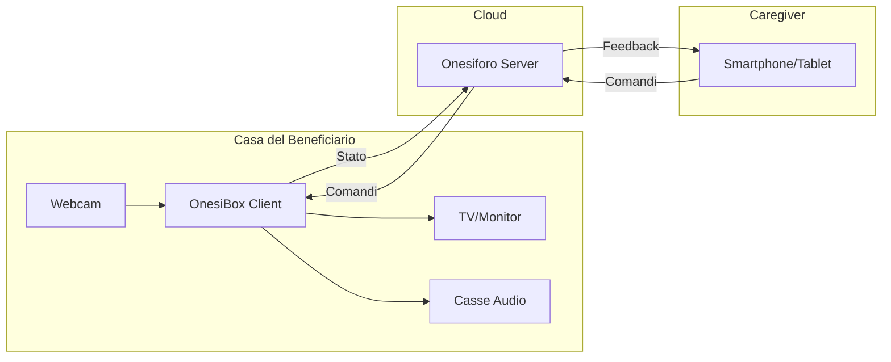
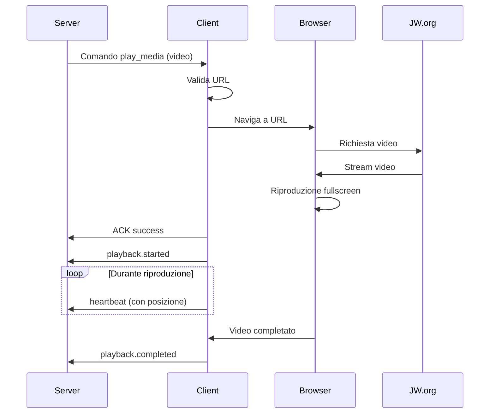
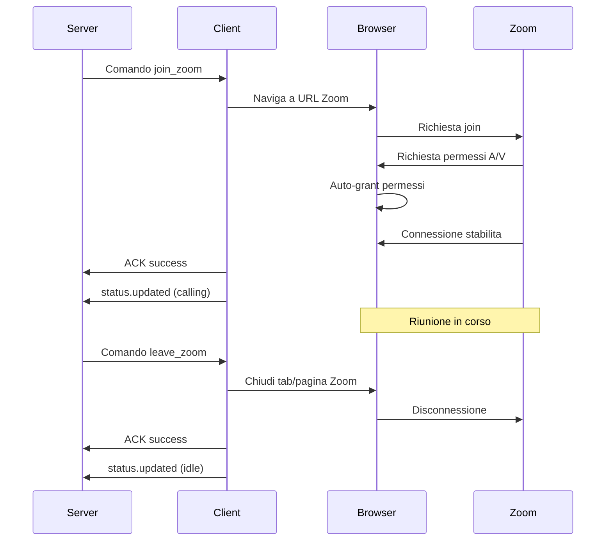
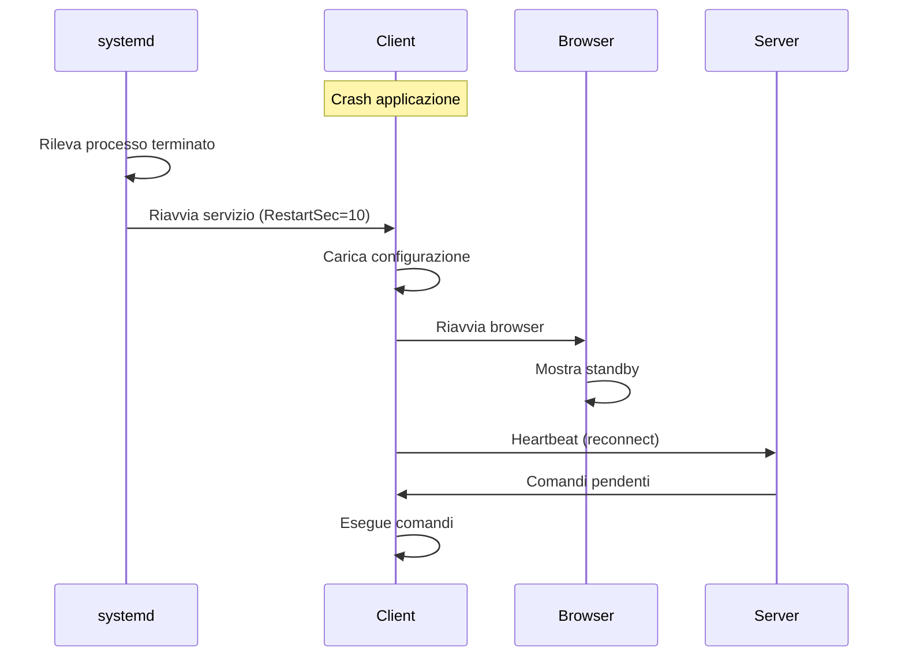

# Specifica dei Requisiti - Client OnesiBox

**Versione:** 1.0
**Data:** Gennaio 2026
**Stato:** Draft

---

## 1. Introduzione

### 1.1 Scopo del Documento

Questo documento definisce i requisiti funzionali e non funzionali del client OnesiBox, l'applicazione che gira sulle appliance Raspberry Pi installate presso le persone assistite.

### 1.2 Ambito del Sistema

Il client OnesiBox e il componente software che:

- Riceve comandi dal server Onesiforo
- Esegue azioni locali (riproduzione media, videochiamate, TTS)
- Monitora lo stato del dispositivo
- Invia feedback e metriche al server

### 1.3 Definizioni e Acronimi

| Termine | Definizione |
|---------|-------------|
| **Appliance** | Dispositivo OnesiBox basato su Raspberry Pi |
| **Kiosk Mode** | Modalita browser fullscreen senza controlli utente |
| **TTS** | Text-to-Speech, sintesi vocale |
| **VNC** | Virtual Network Computing, controllo remoto desktop |
| **Heartbeat** | Segnale periodico di stato inviato al server |
| **Watchdog** | Componente di monitoraggio e auto-riparazione |

### 1.4 Riferimenti

- Documento di Architettura del Client (architettura-client.md)
- Specifica Requisiti Server (requisiti.md nel repository onesiforo-web)
- Specifiche OnesiBox (OnesiBox_Specifiche.pdf)

---

## 2. Descrizione Generale

### 2.1 Prospettiva del Prodotto

Il client OnesiBox opera come terminale remoto controllato dal server Onesiforo:



### 2.2 Utenti del Sistema

#### 2.2.1 Beneficiario (Utente Indiretto)

- **Profilo**: Persona anziana con mobilita ridotta
- **Competenze tecnologiche**: Nessuna
- **Interazione richiesta**: Nessuna (zero-touch)
- **Obiettivo**: Ricevere contenuti e partecipare a videochiamate passivamente

#### 2.2.2 Tecnico di Installazione

- **Profilo**: Volontario o tecnico che installa e configura il dispositivo
- **Competenze**: Conoscenze base di Linux e reti
- **Interazione**: Solo durante setup iniziale e manutenzione

### 2.3 Vincoli di Progetto

| Vincolo | Descrizione | Impatto |
|---------|-------------|---------|
| **Hardware** | Raspberry Pi 5 con 4GB RAM | Ottimizzazione risorse obbligatoria |
| **Rete** | Connessione LTE senza IP pubblico | VNC reverse, no connessioni in ingresso |
| **Utente** | Zero interazione richiesta | Automazione completa, auto-riparazione |
| **Affidabilita** | Funzionamento 24/7 | Watchdog, recovery automatico |
| **Sicurezza** | Dati sensibili, accesso remoto | Crittografia, autenticazione forte |

### 2.4 Assunzioni

- Connessione Internet disponibile (WiFi o LTE)
- Server Onesiforo raggiungibile
- Hardware funzionante e alimentato
- Token di autenticazione configurato correttamente

---

## 3. Requisiti Funzionali

### 3.1 Comunicazione con il Server

#### RFC-001: Connessione al Server

| Attributo | Valore |
|-----------|--------|
| **ID** | RFC-001 |
| **Priorita** | Alta |
| **Descrizione** | Il client deve stabilire e mantenere la connessione con il server Onesiforo |

**Criteri di Accettazione:**

- All'avvio, il client tenta la connessione al server configurato
- La connessione utilizza HTTPS con TLS 1.2 o superiore
- Il client invia il token di autenticazione in ogni richiesta
- In caso di fallimento, il client ritenta con backoff esponenziale
- Lo stato di connessione e visualizzato sulla UI locale

---

#### RFC-002: Ricezione Comandi via Polling

| Attributo | Valore |
|-----------|--------|
| **ID** | RFC-002 |
| **Priorita** | Alta |
| **Descrizione** | Il client deve interrogare periodicamente il server per ricevere comandi |

**Criteri di Accettazione:**

- Il client effettua polling ogni 5 secondi (configurabile)
- Vengono recuperati solo i comandi con status=pending
- I comandi sono processati in ordine di priorita
- Il polling continua anche in caso di errori singoli
- Dopo 3 errori consecutivi, il client entra in modalita offline

---

#### RFC-003: Ricezione Comandi via WebSocket

| Attributo | Valore |
|-----------|--------|
| **ID** | RFC-003 |
| **Priorita** | Alta |
| **Descrizione** | Il client deve ricevere comandi in tempo reale tramite WebSocket |

**Criteri di Accettazione:**

- Il client si connette al server WebSocket (Laravel Reverb)
- Il client si sottoscrive al canale privato dell'appliance
- I comandi ricevuti sono processati immediatamente
- In caso di disconnessione, il client ritenta la connessione
- Se WebSocket non disponibile, fallback a polling

---

#### RFC-004: Invio Heartbeat

| Attributo | Valore |
|-----------|--------|
| **ID** | RFC-004 |
| **Priorita** | Alta |
| **Descrizione** | Il client deve inviare periodicamente segnali di stato al server |

**Criteri di Accettazione:**

- Heartbeat inviato ogni 30 secondi (configurabile)
- Include: stato corrente, metriche CPU/RAM/disco/temperatura
- Include: informazioni sul media in riproduzione (se presente)
- In caso di fallimento, ritenta al prossimo ciclo
- Il server usa l'heartbeat per determinare lo stato online/offline

---

#### RFC-005: Conferma Esecuzione Comandi

| Attributo | Valore |
|-----------|--------|
| **ID** | RFC-005 |
| **Priorita** | Alta |
| **Descrizione** | Il client deve confermare l'esecuzione di ogni comando ricevuto |

**Criteri di Accettazione:**

- Dopo l'esecuzione, invia ACK con status success/failed/skipped
- In caso di errore, include codice e messaggio descrittivo
- Include timestamp di esecuzione
- L'ACK e inviato entro 5 secondi dal completamento
- In caso di fallimento invio ACK, ritenta fino a 3 volte

---

### 3.2 Riproduzione Multimediale

#### RFC-006: Riproduzione Video JW.org

| Attributo | Valore |
|-----------|--------|
| **ID** | RFC-006 |
| **Priorita** | Alta |
| **Descrizione** | Il client deve riprodurre video da JW.org su comando del server |

**Criteri di Accettazione:**

- Ricevuto comando play_media con URL video, il client naviga all'URL
- La riproduzione avviene in fullscreen automaticamente
- L'audio e attivo al volume configurato
- Il client notifica al server l'avvio della riproduzione
- Il client notifica al server la posizione corrente periodicamente
- Al termine, il client notifica il completamento

---

#### RFC-007: Riproduzione Audio JW.org

| Attributo | Valore |
|-----------|--------|
| **ID** | RFC-007 |
| **Priorita** | Alta |
| **Descrizione** | Il client deve riprodurre audio da JW.org su comando del server |

**Criteri di Accettazione:**

- Ricevuto comando play_media con URL audio, il client avvia la riproduzione
- Durante la riproduzione audio, mostra una schermata di standby appropriata
- L'audio e riprodotto al volume configurato
- Il client notifica al server eventi di playback

---

#### RFC-008: Controllo Riproduzione

| Attributo | Valore |
|-----------|--------|
| **ID** | RFC-008 |
| **Priorita** | Alta |
| **Descrizione** | Il client deve gestire i comandi di controllo della riproduzione |

**Criteri di Accettazione:**

- **pause_media**: mette in pausa la riproduzione corrente
- **resume_media**: riprende la riproduzione dalla posizione corrente
- **stop_media**: interrompe la riproduzione e torna alla schermata di standby
- **set_volume**: imposta il volume al livello specificato (0-100)
- Ogni azione viene confermata al server

---

#### RFC-009: Validazione URL Media

| Attributo | Valore |
|-----------|--------|
| **ID** | RFC-009 |
| **Priorita** | Alta |
| **Descrizione** | Il client deve validare che gli URL appartengano a domini autorizzati |

**Criteri di Accettazione:**

- Sono accettati URL dai domini: jw.org, www.jw.org, wol.jw.org, *.jw-cdn.org, download-a.akamaihd.net
- URL non autorizzati vengono rifiutati con errore E005
- La validazione avviene prima di navigare all'URL
- Il client non esegue redirect verso domini non autorizzati

---

### 3.3 Videochiamate

#### RFC-010: Partecipazione Riunione Zoom

| Attributo | Valore |
|-----------|--------|
| **ID** | RFC-010 |
| **Priorita** | Alta |
| **Descrizione** | Il client deve partecipare automaticamente a riunioni Zoom |

**Criteri di Accettazione:**

- Ricevuto comando join_zoom, il client naviga all'URL della riunione
- Il client accetta automaticamente i permessi audio/video
- La riunione viene visualizzata in fullscreen
- Il client notifica al server l'avvenuto collegamento
- Ricevuto comando leave_zoom, il client termina la riunione

---

#### RFC-011: Videochiamata Jitsi Meet

| Attributo | Valore |
|-----------|--------|
| **ID** | RFC-011 |
| **Priorita** | Media |
| **Descrizione** | Il client deve supportare videochiamate tramite Jitsi Meet |

**Criteri di Accettazione:**

- Ricevuto comando start_jitsi, il client naviga alla stanza specificata
- Il client accetta automaticamente i permessi audio/video
- Il display name e configurato come specificato nel comando
- Ricevuto comando stop_jitsi, il client termina la chiamata

---

### 3.4 Comunicazione Vocale

#### RFC-012: Sintesi Vocale (TTS)

| Attributo | Valore |
|-----------|--------|
| **ID** | RFC-012 |
| **Priorita** | Media |
| **Descrizione** | Il client deve sintetizzare e riprodurre messaggi vocali |

**Criteri di Accettazione:**

- Ricevuto comando speak_text, il client sintetizza il testo in voce
- La lingua di sintesi e configurabile (default: italiano)
- La voce e selezionabile (maschile/femminile)
- La velocita di lettura e configurabile
- La sintesi interrompe la riproduzione in corso (o si sovrappone, configurabile)
- Il client conferma al server il completamento della sintesi

---

#### RFC-013: Visualizzazione Messaggi

| Attributo | Valore |
|-----------|--------|
| **ID** | RFC-013 |
| **Priorita** | Media |
| **Descrizione** | Il client deve visualizzare messaggi testuali a schermo |

**Criteri di Accettazione:**

- Ricevuto comando show_message, visualizza titolo e corpo del messaggio
- Il messaggio e mostrato in overlay sulla riproduzione corrente
- La durata di visualizzazione e specificata nel comando
- Il messaggio scompare automaticamente dopo la durata specificata
- Font grande e leggibile per persone anziane

---

### 3.5 Controllo Sistema

#### RFC-014: Riavvio Dispositivo

| Attributo | Valore |
|-----------|--------|
| **ID** | RFC-014 |
| **Priorita** | Alta |
| **Descrizione** | Il client deve poter riavviare il dispositivo su comando |

**Criteri di Accettazione:**

- Ricevuto comando reboot, il client avvia il riavvio
- Il delay specificato nel payload e rispettato
- Prima del riavvio, il client invia conferma al server
- Dopo il riavvio, il client si riconnette automaticamente

---

#### RFC-015: Spegnimento Dispositivo

| Attributo | Valore |
|-----------|--------|
| **ID** | RFC-015 |
| **Priorita** | Alta |
| **Descrizione** | Il client deve poter spegnere il dispositivo su comando |

**Criteri di Accettazione:**

- Ricevuto comando shutdown, il client avvia lo spegnimento
- Il delay specificato nel payload e rispettato
- Prima dello spegnimento, il client invia conferma al server
- Lo spegnimento e sicuro (unmount filesystem)

---

#### RFC-016: Regolazione Volume

| Attributo | Valore |
|-----------|--------|
| **ID** | RFC-016 |
| **Priorita** | Alta |
| **Descrizione** | Il client deve gestire il volume audio del sistema |

**Criteri di Accettazione:**

- Ricevuto comando set_volume, imposta il volume al livello specificato (0-100)
- Il volume e applicato a tutte le uscite audio
- Il volume persiste tra riavvii
- Il client conferma l'impostazione al server

---

### 3.6 Accesso Remoto

#### RFC-017: VNC Reverse

| Attributo | Valore |
|-----------|--------|
| **ID** | RFC-017 |
| **Priorita** | Bassa |
| **Descrizione** | Il client deve supportare sessioni VNC reverse per assistenza tecnica |

**Criteri di Accettazione:**

- Ricevuto comando start_vnc, il client avvia una connessione VNC reverse
- La connessione e stabilita verso il server specificato nel payload
- Un timeout di sicurezza termina la sessione automaticamente
- Ricevuto comando stop_vnc, il client termina la sessione immediatamente
- Il client notifica al server l'avvio e la terminazione della sessione

---

#### RFC-018: Screenshot Remoto

| Attributo | Valore |
|-----------|--------|
| **ID** | RFC-018 |
| **Priorita** | Bassa |
| **Descrizione** | Il client deve poter catturare e inviare screenshot |

**Criteri di Accettazione:**

- Su richiesta, il client cattura uno screenshot della schermata corrente
- Lo screenshot e compresso (JPEG) prima dell'invio
- Lo screenshot e inviato al server tramite API dedicata
- Il client conferma l'avvenuto invio

---

#### RFC-019: Cattura Foto Webcam

| Attributo | Valore |
|-----------|--------|
| **ID** | RFC-019 |
| **Priorita** | Bassa |
| **Descrizione** | Il client deve poter catturare foto dalla webcam |

**Criteri di Accettazione:**

- Su richiesta, il client cattura un'immagine dalla webcam
- L'immagine e compressa (JPEG) prima dell'invio
- L'immagine e inviata al server tramite API dedicata
- Se webcam non disponibile, restituisce errore appropriato

---

### 3.7 Monitoraggio

#### RFC-020: Raccolta Metriche Sistema

| Attributo | Valore |
|-----------|--------|
| **ID** | RFC-020 |
| **Priorita** | Alta |
| **Descrizione** | Il client deve raccogliere e inviare metriche di sistema |

**Criteri di Accettazione:**

- Raccolta periodica di: CPU usage, RAM usage, disco usage, temperatura
- Raccolta di: uptime, versione firmware, stato rete
- Le metriche sono inviate con ogni heartbeat
- Soglie di allarme configurabili localmente

---

#### RFC-021: Invio Log di Sistema

| Attributo | Valore |
|-----------|--------|
| **ID** | RFC-021 |
| **Priorita** | Media |
| **Descrizione** | Il client deve poter inviare log di sistema al server |

**Criteri di Accettazione:**

- Su richiesta, il client raccoglie gli ultimi N righe di log
- I log sono compressi prima dell'invio
- I log sono inviati al server tramite API dedicata
- Sono inclusi log di sistema e log applicativi

---

### 3.8 Configurazione Dinamica

#### RFC-022: Aggiornamento Configurazione Remota

| Attributo | Valore |
|-----------|--------|
| **ID** | RFC-022 |
| **Priorita** | Media |
| **Descrizione** | Il client deve supportare l'aggiornamento della configurazione da remoto |

**Criteri di Accettazione:**

- Ricevuto comando update_config, il client aggiorna il parametro specificato
- I parametri configurabili includono: polling_interval, heartbeat_interval, volume, ecc.
- La nuova configurazione e persistita localmente
- La nuova configurazione e applicata immediatamente o al prossimo ciclo
- Il client conferma l'aggiornamento al server

---

### 3.9 Auto-riparazione

#### RFC-023: Watchdog Applicativo

| Attributo | Valore |
|-----------|--------|
| **ID** | RFC-023 |
| **Priorita** | Alta |
| **Descrizione** | Il client deve monitorare la propria salute e auto-ripararsi |

**Criteri di Accettazione:**

- Il processo principale e monitorato da systemd
- In caso di crash, systemd riavvia automaticamente il servizio
- Il browser e monitorato per rilevare blocchi
- In caso di browser bloccato, viene riavviato automaticamente
- Le azioni di recovery sono loggate

---

#### RFC-024: Watchdog Hardware

| Attributo | Valore |
|-----------|--------|
| **ID** | RFC-024 |
| **Priorita** | Alta |
| **Descrizione** | Il client deve utilizzare il watchdog hardware del Raspberry Pi |

**Criteri di Accettazione:**

- Il watchdog hardware (bcm2835_wdog) e abilitato
- Il client "accarezza" il watchdog periodicamente
- Se il client non risponde per 60 secondi, il Pi si riavvia automaticamente
- Il timeout del watchdog e configurabile

---

#### RFC-025: Recovery dopo Disconnessione

| Attributo | Valore |
|-----------|--------|
| **ID** | RFC-025 |
| **Priorita** | Alta |
| **Descrizione** | Il client deve gestire disconnessioni di rete gracefully |

**Criteri di Accettazione:**

- In caso di disconnessione, il client ritenta con backoff esponenziale
- Lo stato locale e preservato durante la disconnessione
- Alla riconnessione, il client invia lo stato corrente al server
- I comandi in coda vengono eseguiti alla riconnessione

---

### 3.10 Interfaccia Locale

#### RFC-026: Schermata di Standby

| Attributo | Valore |
|-----------|--------|
| **ID** | RFC-026 |
| **Priorita** | Alta |
| **Descrizione** | Il client deve mostrare una schermata di standby quando inattivo |

**Criteri di Accettazione:**

- Quando non c'e riproduzione attiva, mostra schermata di standby
- La schermata include: logo, ora corrente, stato connessione
- La schermata e visivamente piacevole e non invasiva
- Eventuali messaggi di errore sono visualizzati chiaramente

---

#### RFC-027: Indicatore Stato Connessione

| Attributo | Valore |
|-----------|--------|
| **ID** | RFC-027 |
| **Priorita** | Media |
| **Descrizione** | Il client deve mostrare lo stato della connessione |

**Criteri di Accettazione:**

- Indicatore visivo: verde=connesso, giallo=riconnessione, rosso=offline
- L'indicatore e visibile in overlay durante la riproduzione
- L'indicatore e discreto e non invasivo
- Il beneficiario puo capire a colpo d'occhio se il sistema funziona

---

## 4. Requisiti Non Funzionali

### 4.1 Prestazioni

#### RNFC-001: Tempo di Avvio

| Attributo | Valore |
|-----------|--------|
| **ID** | RNFC-001 |
| **Categoria** | Prestazioni |
| **Descrizione** | Il client deve avviarsi in tempi ragionevoli |

**Specifiche:**

- Tempo da accensione a schermata di standby: < 60 secondi
- Tempo da avvio applicazione a connessione server: < 10 secondi
- Primo heartbeat inviato entro 15 secondi dall'avvio

---

#### RNFC-002: Latenza Esecuzione Comandi

| Attributo | Valore |
|-----------|--------|
| **ID** | RNFC-002 |
| **Categoria** | Prestazioni |
| **Descrizione** | I comandi devono essere eseguiti rapidamente |

**Specifiche:**

- Tempo da ricezione comando a inizio esecuzione: < 1 secondo
- Tempo di caricamento pagina JW.org: < 5 secondi
- Tempo di join Zoom dopo ricezione comando: < 10 secondi

---

#### RNFC-003: Consumo Risorse

| Attributo | Valore |
|-----------|--------|
| **ID** | RNFC-003 |
| **Categoria** | Prestazioni |
| **Descrizione** | Il client deve operare efficientemente su hardware limitato |

**Specifiche:**

- Consumo RAM in idle: < 500MB
- Consumo RAM durante riproduzione video: < 1GB
- Consumo CPU in idle: < 10%
- Nessun memory leak rilevabile in 7 giorni di esecuzione continua

---

### 4.2 Affidabilita

#### RNFC-004: Disponibilita

| Attributo | Valore |
|-----------|--------|
| **ID** | RNFC-004 |
| **Categoria** | Affidabilita |
| **Descrizione** | Il client deve essere disponibile 24/7 |

**Specifiche:**

- Uptime target: 99.9% (escludendo manutenzione rete/elettrica)
- Recovery automatico dopo crash entro 2 minuti
- Recovery automatico dopo riavvio hardware entro 90 secondi

---

#### RNFC-005: Tolleranza ai Guasti

| Attributo | Valore |
|-----------|--------|
| **ID** | RNFC-005 |
| **Categoria** | Affidabilita |
| **Descrizione** | Il client deve gestire gracefully i guasti |

**Specifiche:**

- Fallback WebSocket -> Polling automatico
- Retry automatico con backoff esponenziale
- Nessuna perdita di stato dopo crash/riavvio
- Comandi non eseguibili notificati al server con errore

---

#### RNFC-006: Auto-riparazione

| Attributo | Valore |
|-----------|--------|
| **ID** | RNFC-006 |
| **Categoria** | Affidabilita |
| **Descrizione** | Il client deve auto-ripararsi senza intervento umano |

**Specifiche:**

- Riavvio automatico del servizio in caso di crash (systemd)
- Riavvio automatico del browser in caso di blocco
- Riavvio hardware tramite watchdog se sistema non risponde
- Log di tutti gli eventi di recovery

---

### 4.3 Sicurezza

#### RNFC-007: Crittografia Comunicazioni

| Attributo | Valore |
|-----------|--------|
| **ID** | RNFC-007 |
| **Categoria** | Sicurezza |
| **Descrizione** | Tutte le comunicazioni devono essere cifrate |

**Specifiche:**

- HTTPS obbligatorio per tutte le richieste API (TLS 1.2+)
- WebSocket sicure (WSS)
- Verifica certificati SSL abilitata
- No fallback a HTTP non cifrato

---

#### RNFC-008: Autenticazione

| Attributo | Valore |
|-----------|--------|
| **ID** | RNFC-008 |
| **Categoria** | Sicurezza |
| **Descrizione** | Il client deve autenticarsi con il server |

**Specifiche:**

- Token di autenticazione univoco per appliance
- Token memorizzato in modo sicuro (permessi file restrittivi)
- Token incluso in ogni richiesta (header Authorization)
- Token non loggato in chiaro

---

#### RNFC-009: Validazione Input

| Attributo | Valore |
|-----------|--------|
| **ID** | RNFC-009 |
| **Categoria** | Sicurezza |
| **Descrizione** | Tutti gli input devono essere validati |

**Specifiche:**

- Validazione struttura JSON dei comandi
- Validazione tipi e valori dei parametri
- Validazione URL contro whitelist domini
- Rifiuto comandi malformati con errore

---

#### RNFC-010: Accesso Sistema

| Attributo | Valore |
|-----------|--------|
| **ID** | RNFC-010 |
| **Categoria** | Sicurezza |
| **Descrizione** | L'accesso al sistema deve essere limitato |

**Specifiche:**

- SSH disabilitato o accessibile solo via Cloudflare Tunnel
- Nessuna porta esposta direttamente su Internet
- Utente applicativo non-root con permessi minimi
- Firewall attivo con regole minime

---

### 4.4 Usabilita

#### RNFC-011: Zero Configurazione Utente

| Attributo | Valore |
|-----------|--------|
| **ID** | RNFC-011 |
| **Categoria** | Usabilita |
| **Descrizione** | L'utente finale non deve configurare nulla |

**Specifiche:**

- Avvio automatico all'accensione
- Nessun popup o dialog richiesto
- Auto-accettazione permessi browser
- Recovery automatico senza intervento

---

#### RNFC-012: Feedback Visivo

| Attributo | Valore |
|-----------|--------|
| **ID** | RNFC-012 |
| **Categoria** | Usabilita |
| **Descrizione** | Il sistema deve fornire feedback visivo sullo stato |

**Specifiche:**

- Indicatore stato connessione sempre visibile
- Schermata di caricamento durante transizioni
- Messaggi di errore leggibili (font grande)
- Nessun elemento tecnico/confuso mostrato

---

### 4.5 Manutenibilita

#### RNFC-013: Logging

| Attributo | Valore |
|-----------|--------|
| **ID** | RNFC-013 |
| **Categoria** | Manutenibilita |
| **Descrizione** | Il client deve mantenere log dettagliati |

**Specifiche:**

- Log strutturati (JSON) per analisi automatica
- Livelli di log configurabili (debug, info, warn, error)
- Rotazione automatica dei log (max 100MB)
- Nessun dato sensibile nei log

---

#### RNFC-014: Aggiornamenti

| Attributo | Valore |
|-----------|--------|
| **ID** | RNFC-014 |
| **Categoria** | Manutenibilita |
| **Descrizione** | Il client deve supportare aggiornamenti remoti |

**Specifiche:**

- Meccanismo di aggiornamento OTA (over-the-air)
- Verifica firma pacchetti prima dell'installazione
- Rollback automatico in caso di aggiornamento fallito
- Aggiornamento senza perdita di configurazione

---

#### RNFC-015: Diagnostica Remota

| Attributo | Valore |
|-----------|--------|
| **ID** | RNFC-015 |
| **Categoria** | Manutenibilita |
| **Descrizione** | Il tecnico deve poter diagnosticare problemi da remoto |

**Specifiche:**

- Invio log su richiesta
- Invio screenshot su richiesta
- Metriche sistema dettagliate nell'heartbeat
- VNC reverse per debug interattivo

---

### 4.6 Compatibilita

#### RNFC-016: Hardware Supportato

| Attributo | Valore |
|-----------|--------|
| **ID** | RNFC-016 |
| **Categoria** | Compatibilita |
| **Descrizione** | Il client deve funzionare sull'hardware specificato |

**Specifiche:**

- Raspberry Pi 5 (4GB/8GB RAM)
- Raspberry Pi 4 (4GB RAM) - supporto legacy
- Display HDMI (qualsiasi risoluzione)
- Webcam USB compatibili V4L2

---

#### RNFC-017: Sistema Operativo

| Attributo | Valore |
|-----------|--------|
| **ID** | RNFC-017 |
| **Categoria** | Compatibilita |
| **Descrizione** | Il client deve funzionare sul sistema operativo specificato |

**Specifiche:**

- Raspberry Pi OS Lite 64-bit (Bookworm)
- Kernel 6.1 o superiore
- Chromium 120 o superiore

---

## 5. Matrice di Tracciabilita

### 5.1 Requisiti per Funzionalita

| Funzionalita | Requisiti |
|--------------|-----------|
| Comunicazione | RFC-001, RFC-002, RFC-003, RFC-004, RFC-005 |
| Riproduzione Media | RFC-006, RFC-007, RFC-008, RFC-009 |
| Videochiamate | RFC-010, RFC-011 |
| Comunicazione Vocale | RFC-012, RFC-013 |
| Controllo Sistema | RFC-014, RFC-015, RFC-016 |
| Accesso Remoto | RFC-017, RFC-018, RFC-019 |
| Monitoraggio | RFC-020, RFC-021 |
| Configurazione Dinamica | RFC-022 |
| Auto-riparazione | RFC-023, RFC-024, RFC-025 |
| Interfaccia Locale | RFC-026, RFC-027 |

### 5.2 Priorita Requisiti


| Priorita | Requisiti Funzionali |
|----------|---------------------|
| **Alta** | RFC-001 - RFC-010, RFC-014 - RFC-016, RFC-020, RFC-023 - RFC-026 |
| **Media** | RFC-011 - RFC-013, RFC-021, RFC-022, RFC-027 |
| **Bassa** | RFC-017 - RFC-019 |

---

## 6. Casi d'Uso Principali

### 6.1 UC-C001: Riproduzione Video



### 6.2 UC-C002: Partecipazione Zoom



### 6.3 UC-C003: Recovery da Crash



---

## 7. Dipendenze Esterne

### 7.1 Servizi

| Servizio | Utilizzo | Criticita |
|----------|----------|-----------|
| Server Onesiforo | Ricezione comandi, invio stato | Alta |
| JW.org CDN | Streaming contenuti | Alta |
| Zoom | Videochiamate riunioni | Alta |
| Jitsi Meet | Videochiamate dirette | Media |
| DNS | Risoluzione nomi | Alta |
| NTP | Sincronizzazione ora | Media |

### 7.2 Librerie

| Libreria | Versione | Licenza | Scopo |
|----------|----------|---------|-------|
| ws | ^8.x | MIT | WebSocket client |
| axios | ^1.x | MIT | HTTP client |
| winston | ^3.x | MIT | Logging |
| systeminformation | ^5.x | MIT | Metriche sistema |
| playwright | ^1.x | Apache 2.0 | Automazione browser |
| espeak-ng | - | GPL | TTS offline |

---

## 8. Appendici

### A. Configurazione Minima

```json
{
  "server_url": "https://onesiforo.example.com",
  "appliance_id": "uuid-here",
  "appliance_token": "token-here",
  "polling_interval_seconds": 5,
  "heartbeat_interval_seconds": 30,
  "websocket_enabled": true,
  "tts_engine": "espeak",
  "tts_language": "it",
  "default_volume": 80,
  "watchdog_enabled": true,
  "watchdog_timeout_seconds": 60
}
```

### B. Storico Revisioni

| Versione | Data | Autore | Modifiche |
|----------|------|--------|-----------|
| 1.0 | Gennaio 2026 | Team Onesiforo | Prima stesura |
